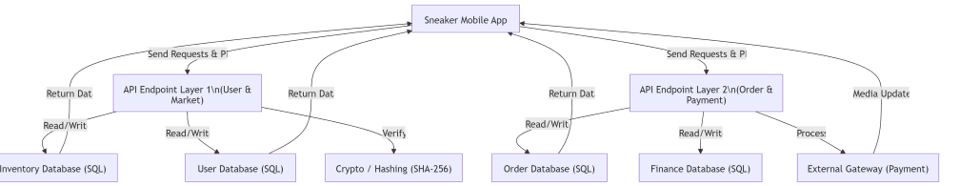
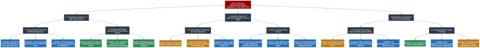

# Activity: Apply the PASTA threat model framework

## Activity Overview

In this activity, I applied the PASTA (Process for Attack Simulation and Threat Analysis) threat modeling framework to a sneaker marketplace application.

The project focused on:
- Identifying business and security objectives
- Defining the technical scope
- Analyzing threats and vulnerabilities
- Modeling attacks
- Recommending security controls

The application allows users to buy and sell sneakers while handling sensitive information such as payment data, personal information, authentication records, and shipping details.

---

# PASTA Worksheet

## I. Define business and security objectives

### Make 2-3 notes of specific business requirements that will be analyzed.

- The application is allowing users to buy as well as to sell sneakers on the platform.
- An app like this would involve a lot of back end processing dealing with market matching, escrow and complex payouts, shipping and webhook tracking.
- There are a couple regulations that should be considered including PCI-DSS which regulates how apps secure credit card details, as well as the protection of PII for customers.

---

## II. Define the technical scope

### List of technologies used by the application:

- API
- PKI
- SHA-256
- SQL

The application that would be prioritized over the others would be SQL since it is the foundation. The company must design a database schema first. If the company does not correctly map out how Buyers, Sellers, Shoes, Bids, and Asks relate to one another in SQL, the app will fail. Fixing a broken database structure later in development is incredibly difficult and expensive.

---

## III. Decompose application

### Data Flow Diagram

The data flow diagram demonstrates how users, systems, APIs, databases, and payment processes interact throughout the sneaker marketplace application.

**Picture1**  

---

## IV. Threat analysis

### List 2 types of threats in the PASTA worksheet that are risks to the information being handled by the application.

- **Internal threats:**  
  An employee with database access can steal user records or alter sneaker authentication records for personal gain.

- **External threats:**  
  An outsider attacker or automated bot program can bypass the mobile app interface to buy hyped sneakers instantly.

---

## V. Vulnerability analysis

### List 2 vulnerabilities in the PASTA worksheet that could be exploited.

- There could be a codebase that exposes a massive weakness within the database. When writing the backend code for the shoe search bar, a developer might use string concatenation to build database queries instead of using parameterized queries.

- There can be a network and PKI flaw involving a man-in-the-middle attack caused by missing certificate pinning. The app uses HTTPS, but the mobile application trusts any valid SSL certificate issued by a public authority instead of pinning the server’s exact certificate.

---

## VI. Attack modeling

### Attack Tree

The attack tree demonstrates possible attack paths an attacker could use to compromise the sneaker marketplace application.

**Picture2**  

---

## VII. Risk analysis and impact

### Recommended security controls

- Parameterized queries (Database control)
- TLS certificate pinning (Network control)
- API rate limiting and WAF (Codebase and network control)
- Server-side validation (Codebase control)

These controls help reduce risks associated with:
- SQL injection
- API abuse
- Man-in-the-middle attacks
- Unauthorized access
- Automated bot attacks

---

# Outcome

This activity demonstrated how the PASTA threat modeling framework can be used to identify risks, analyze vulnerabilities, and design security controls for a modern application.

The project combined business analysis, technical architecture, threat analysis, vulnerability assessment, and attack modeling into a structured security assessment process.

---

# Key Takeaway

Threat modeling helps organizations proactively identify security weaknesses before attackers can exploit them. Applying frameworks such as PASTA improves application security, risk awareness, and secure development practices.

---

# Skills Demonstrated

- Threat Modeling
- PASTA Framework
- Risk Analysis
- Vulnerability Analysis
- Attack Tree Modeling
- Data Flow Diagram Analysis
- Application Security
- API Security
- SQL Injection Prevention
- Security Control Recommendations
