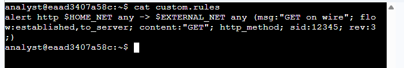
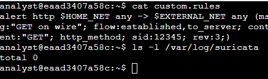
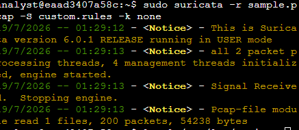
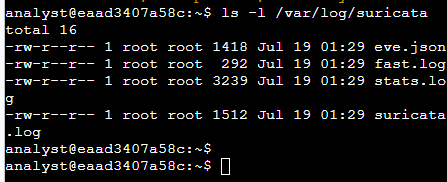
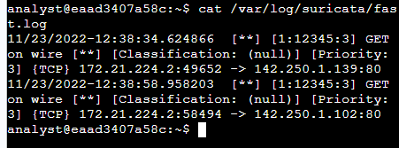
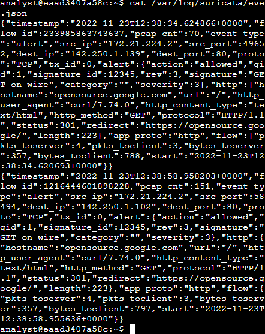
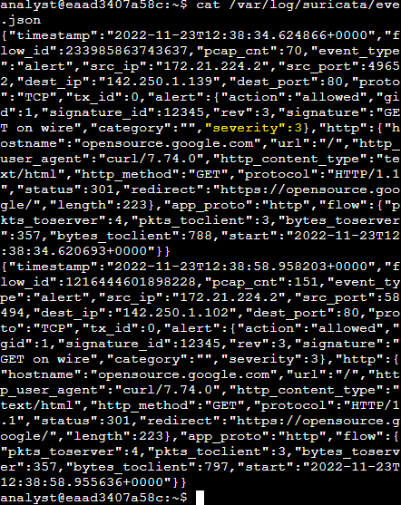
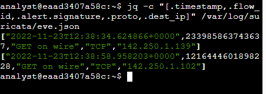

# Activity: Examine Alerts, Logs, and Rules with Suricata

## Activity Overview

Previously, I learned about packet analysis and the basic syntax and components of intrusion detection system (IDS) signatures and rules. I also learned how to examine prewritten signatures and their log output using **Suricata**, an open-source intrusion detection system (IDS), intrusion prevention system (IPS), and network analysis tool.

In this activity, I explored Suricata alerts and logs, examined the process of rule creation, triggered custom rules against network traffic, and analyzed the resulting log files.

---

## Scenario

As a security analyst, I was responsible for monitoring traffic on an organization's network. During this activity I:

- Examined a custom Suricata rule
- Triggered alerts using a packet capture (PCAP) file
- Reviewed the generated `fast.log`
- Examined detailed event data stored in `eve.json`

The following lab files were provided:

- `sample.pcap`
- `custom.rules`

---

# Task 1: Examine a Custom Rule in Suricata

The `/home/analyst` directory contains a `custom.rules` file that defines network traffic rules monitored by Suricata.

In this task, I examined the structure and components of the custom rule before executing it against captured network traffic.

**Picture1 – Custom Suricata Rule**



---

# Task 2: Trigger a Custom Rule in Suricata

## Step 1

List the contents of the `/var/log/suricata` directory before running Suricata.

**Picture2 – Initial Log Directory**



---

## Step 2

Run Suricata using the supplied packet capture file and custom rule.

```bash
sudo suricata -r sample.pcap -S custom.rules -k none
```

**Picture3 – Running Suricata**



---

## Step 3

List the `/var/log/suricata` directory again to verify that log files were created.

**Picture4 – Generated Log Files**



---

## Step 4

Display the contents of the generated `fast.log` file.

```bash
cat /var/log/suricata/fast.log
```

**Picture5 – fast.log Output**



---

# Task 3: Examine `eve.json` Output

## Step 1

Display the contents of the `eve.json` log file.

```bash
cat /var/log/suricata/eve.json
```

Review the generated alert information, including:

- Timestamp
- Source IP
- Destination IP
- Alert Signature
- HTTP Request
- Severity

**Picture6 – eve.json Output**



---

### Question

**What is the value of the severity property for the first alert returned by the `jq` command?**

**Answer**

```text
3
```

---

## Step 2

Use the `jq` command to extract specific event data from `eve.json`.

**Picture7 – jq Output**



---

### Questions

**What is the destination IP address listed for the last event in the `eve.json` file?**

**Answer**

```text
142.250.1.102
```

---

**What is the alert signature for the first alert entry in the `eve.json` file?**

**Answer**

```text
GET on wire
```

---

## Final Results

**Picture8 – Final Event Data Review**



---

# Key Takeaways

- Learned how Suricata processes custom IDS rules.
- Triggered alerts using a packet capture file.
- Validated alert generation through `fast.log`.
- Parsed detailed event information from `eve.json`.
- Used the `jq` command to extract specific security event data.

---

# Skills Demonstrated

- Suricata IDS
- Intrusion Detection Systems (IDS)
- Network Security Monitoring
- Packet Capture (PCAP) Analysis
- Linux Command Line
- Log Analysis
- JSON Log Parsing
- Security Operations Center (SOC)
