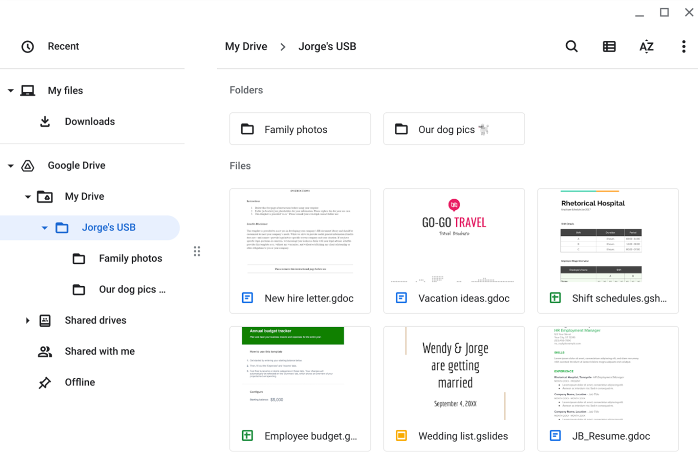

# Activity: Identify the attack vector of a USB drive (Parking lot USB exercise)

## Activity Overview

In this activity, you will assess the attack vectors of a USB drive. You will consider a scenario of finding a USB drive in a parking lot from both the perspective of an attacker and a target.

USBs, or flash drives, are commonly used for storing and transporting data. However, some characteristics of these small, convenient devices can also introduce security risks. Threat actors frequently use USBs to deliver malicious software, damage other hardware, or even take control of devices. USB baiting is an attack in which a threat actor strategically leaves a malware USB stick for an employee to find and install to unknowingly infect a network. It relies on curious people to plug in an unfamiliar flash drive that they find.

Be sure to complete this activity before moving on. The next course item will provide you with a completed exemplar to compare to your own work.

---

## Scenario

You are part of the security team at Rhetorical Hospital and arrive to work one morning. On the ground of the parking lot, you find a USB stick with the hospital's logo printed on it. There’s no one else around who might have dropped it, so you decide to pick it up out of curiosity.

You bring the USB drive back to your office where the team has virtualization software installed on a workstation. Virtualization software can be used for this very purpose because it’s one of the only ways to safely investigate an unfamiliar USB stick. The software works by running a simulated instance of the computer on the same workstation. This simulation isn’t connected to other files or networks, so the USB drive can’t affect other systems if it happens to be infected with malicious software.

Jorge's drive contains a mix of personal and work-related files. For example, it contains folders that appear to store family and pet photos. There is also a new hire letter and an employee shift schedule.

Review the types of information that Jorge has stored on this device.

---

# Parking lot USB exercise

## Contents

Write 2-3 sentences about the types of information found on this device.

- The USB stick has a mixture of PII from an employee named Jorge and work-related files. The files for example has folder’s that has family and pet photos, as well as a new hire letter an employee shift schedule and the user’s resume. It is not safe to store personal files with work related files, because it provides a risk regarding data security, privacy, and legal compliance. Mixing the files can lead to breaches of data, accidental disclosure of PII, malware transmission from personal activities to company networks, as well as potential loss of personal information if a device is wiped by the employer.

**Picture1**  

---

## Attacker mindset

Write 2-3 sentences about how this information could be used against Jorge or the hospital.

- This information provided can be used against other employees because it provides shift schedules, and can be used against the relatives of the employee relatives since it have their family’s personal data such as wedding information listed. This USB also provides business information such as the different shifts for employees and employee budget.

---

## Risk analysis

Write 3 or 4 sentences describing technical, operational, or managerial controls that could mitigate these types of attacks:

- Finding a USB drive in a parking lot that contains both personal and professional files can be considered USB drop or USB baiting attack. Even if the files appear to be legit, the device itself can be weaponized to compromise both the individual and the company. The device can have keystroke injection, Auto-executing malware, and USB firmware, Hardware destruction such as a high voltage surge that instantly destroys the computer’s motherboard. Since the USB has both personal info and business info this can cause concern for physical security safety for the user since it provides their vacation info, can cause social engineering, and identity theft. For the business case this can cause operational sabotage, financial fraud, and network infiltration.

