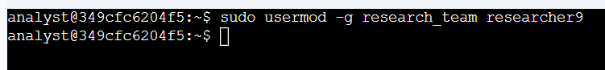
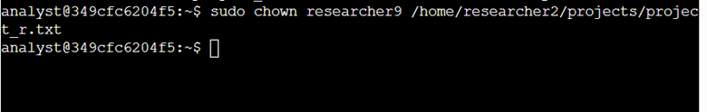
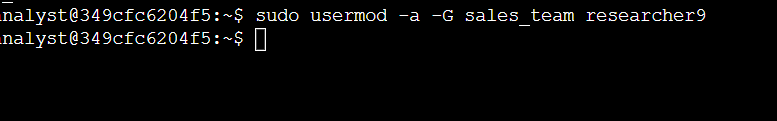
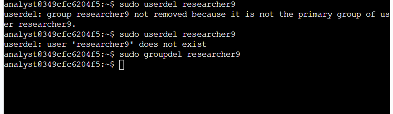

# 👤 Add and Manage Users with Linux Commands  
**Platform:** Coursera – Google Cybersecurity Certificate  
**Skill Level:** Introductory  
**Estimated Time:** ~1 hour  

---

## 🧠 Overview

This lab focuses on authentication and user management in a Linux environment. As a cybersecurity analyst, managing user accounts is essential to maintaining secure access control. This includes creating users, modifying group memberships, assigning file ownership, and properly removing accounts when users leave the organization.

All administrative commands in this lab required elevated privileges using `sudo`.

---

## 🎯 Scenario

In this activity, I managed the lifecycle of a user account named `researcher9`. The tasks included:

- Adding a new user to the system
- Assigning a primary group
- Changing file ownership
- Adding a supplementary group
- Deleting the user when they left the organization

This workflow reflects real-world identity and access management (IAM) responsibilities.

---

## 🛠️ Tools & Commands Used

- `sudo useradd`
- `sudo usermod`
- `sudo chown`
- `sudo userdel`
- `id`

---

## 📝 Task Breakdown & Evidence

---

## 🔹 Task 1: Add a New User

**Objective:**  
Create a new user account named `researcher9` and assign them to the `research_team` group as their primary group.

**Commands Used:**
```bash
sudo useradd researcher9
sudo usermod -g research_team researcher9
```

**Evidence:**


**Security Relevance:**  
Properly adding users ensures accountability and controlled system access.

---

## 🔹 Task 2: Assign File Ownership

**Objective:**  
Transfer ownership of `project_r.txt` to `researcher9`.

**Command Used:**
```bash
sudo chown researcher9 /home/researcher2/projects/project_r.txt
```

**Evidence:**



**Security Relevance:**  
File ownership determines who can modify critical project files. Ensuring correct ownership supports data integrity and accountability.

---

## 🔹 Task 3: Add User to a Secondary Group

**Objective:**  
Add `researcher9` to the `sales_team` group as a supplementary group while keeping their primary group unchanged.

**Command Used:**
```bash
sudo usermod -a -G sales_team researcher9
```

**Evidence:**



**Security Relevance:**  
Supplementary groups allow flexible role-based access control while maintaining structured authorization.

---

## 🔹 Task 4: Delete a User

**Objective:**  
Remove `researcher9` from the system when they leave the organization.

**Command Used:**
```bash
sudo userdel researcher9
```

**Evidence:**





**Security Relevance:**  
Timely account removal prevents unauthorized access and reduces insider threat risk.

---

## ✅ Key Takeaways

- User lifecycle management is a core security responsibility
- Proper group assignments enforce role-based access control (RBAC)
- File ownership must align with job responsibilities
- Removing inactive accounts reduces security exposure

---

## 📌 Skills Demonstrated

- Linux user management  
- Group administration  
- File ownership configuration  
- Principle of least privilege implementation  

---

## 📂 Repository Structure

```text
add-manage-users-linux-lab/
│
├── README.md
└── images/
    ├── Picture1.png
    ├── Picture2.png
    ├── Picture3.png
    ├── Picture4.png
    └── Picture5.png
```

