# Activity: Analyze Packets with Wireshark

## Task 1. Explore data with Wireshark

In this task, you must open a network packet capture file that contains data captured from a system that made web requests to a site.

### Step 1
Open the packet capture file (`sample.pcap`) in Wireshark.

**Picture1**
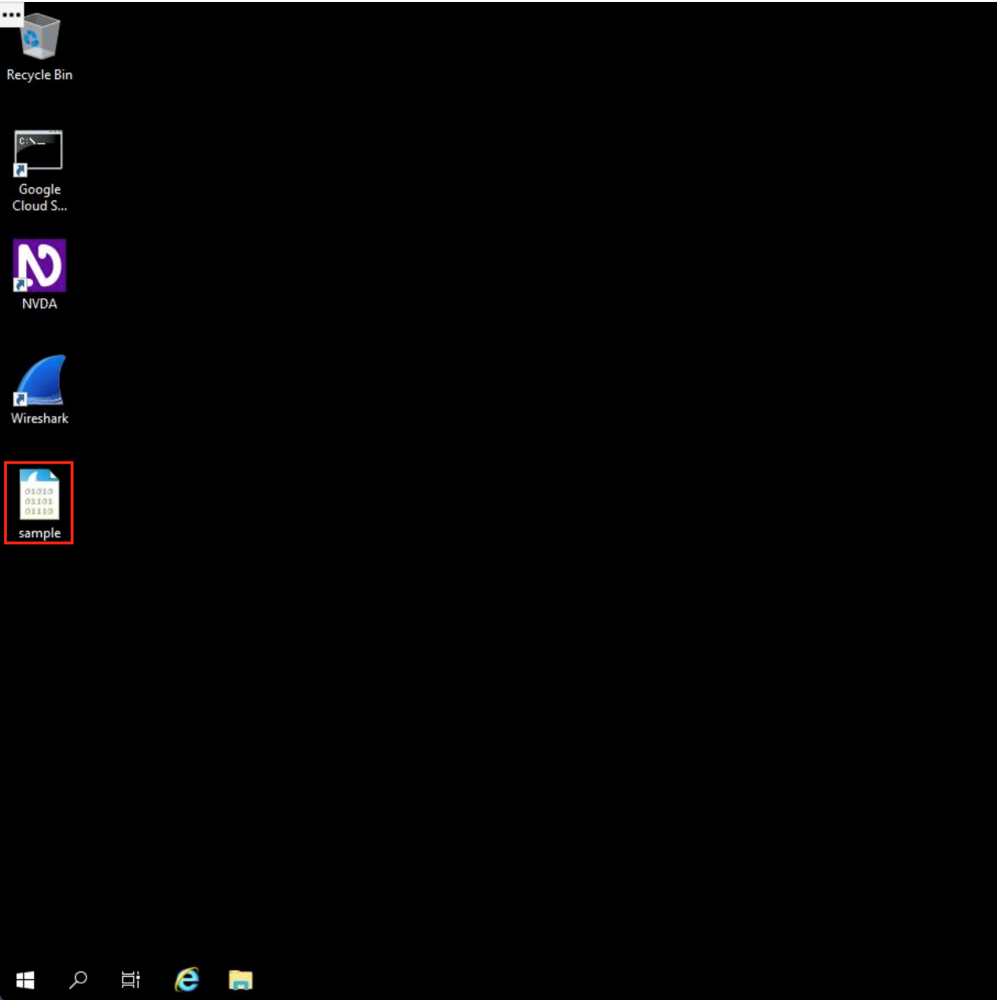

### Step 2
Maximize the Wireshark application window.

**Picture2**
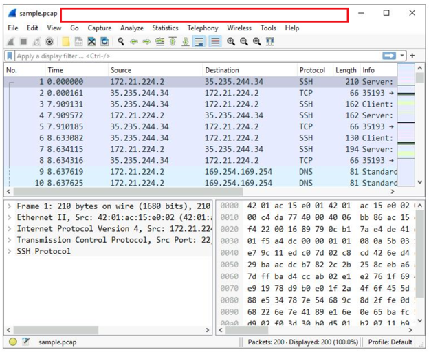

### Step 3
Review the packet list and packet information columns:

- No.
- Time
- Source
- Destination
- Protocol
- Length
- Info

**Picture3**
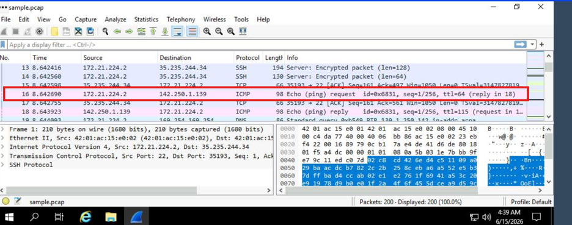

### Question

What is the protocol of the first packet in the list where the Info column starts with "Echo (ping) request"?

**Answer:** ICMP

**Picture4**
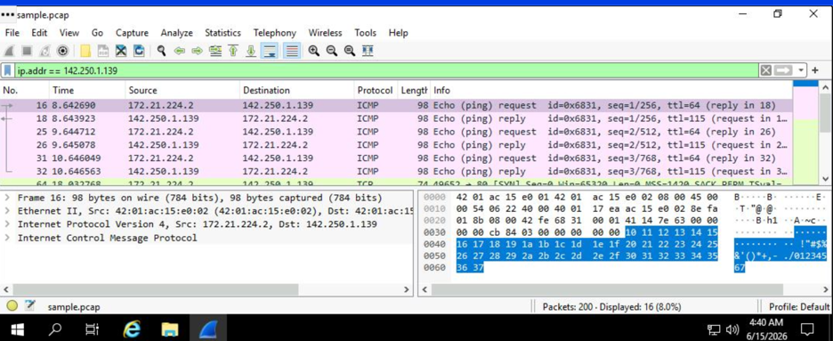

---

## Task 2. Apply a basic Wireshark filter and inspect a packet

### Step 1
Apply the following display filter:

```text
ip.addr == 142.250.1.139
```

**Picture5**
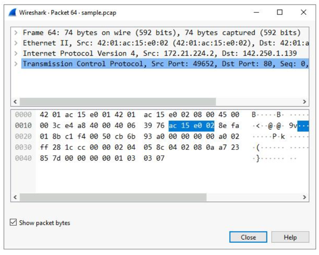

### Step 2
Open the first TCP packet and review the packet details.

**Picture6**
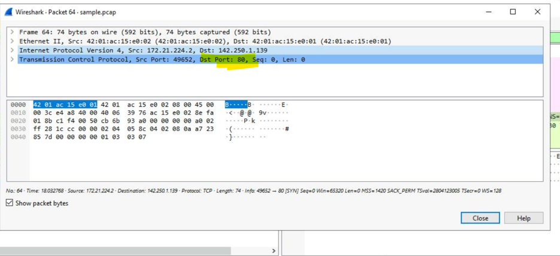

### Step 3
Expand the following sections:

- Frame
- Ethernet II
- Internet Protocol Version 4
- Transmission Control Protocol

**Picture7**
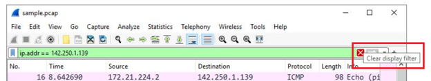

### Question

What is the TCP destination port of this packet?

**Answer:** Port 80

**Picture8**
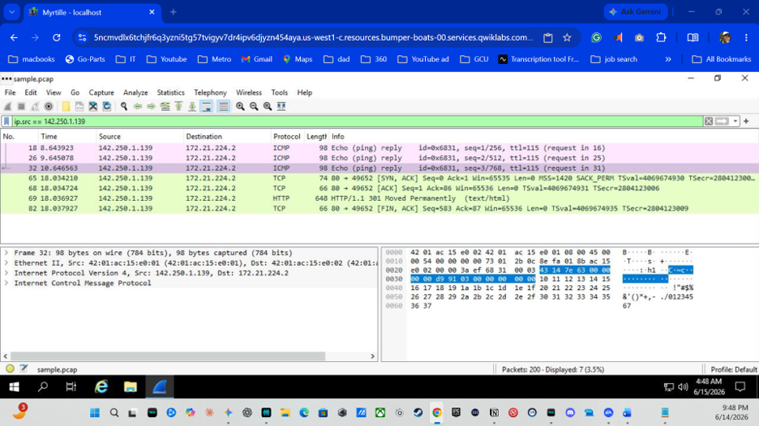

---

## Task 3. Use filters to select packets

Apply the following filters:

```text
ip.src == 142.250.1.139
```

```text
ip.dst == 142.250.1.139
```

```text
eth.addr == 42:01:ac:15:e0:02
```

**Picture9**
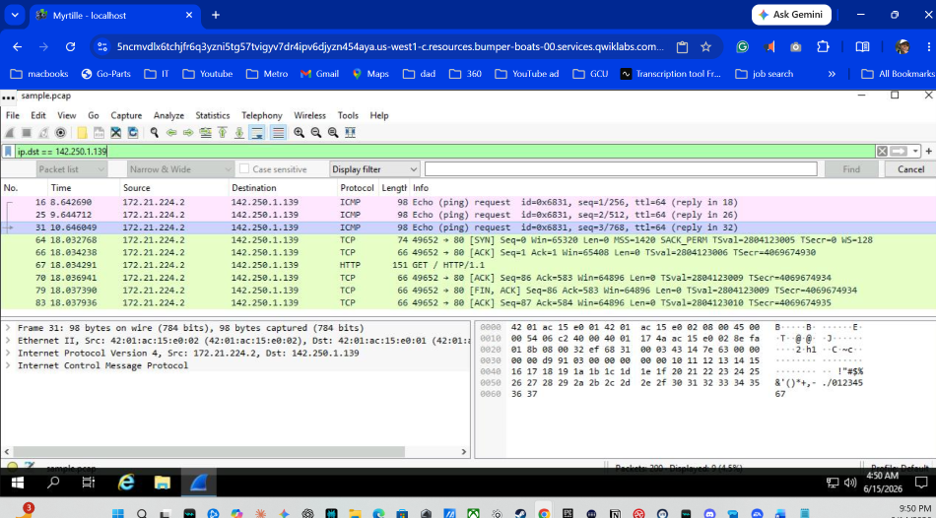

**Picture10**
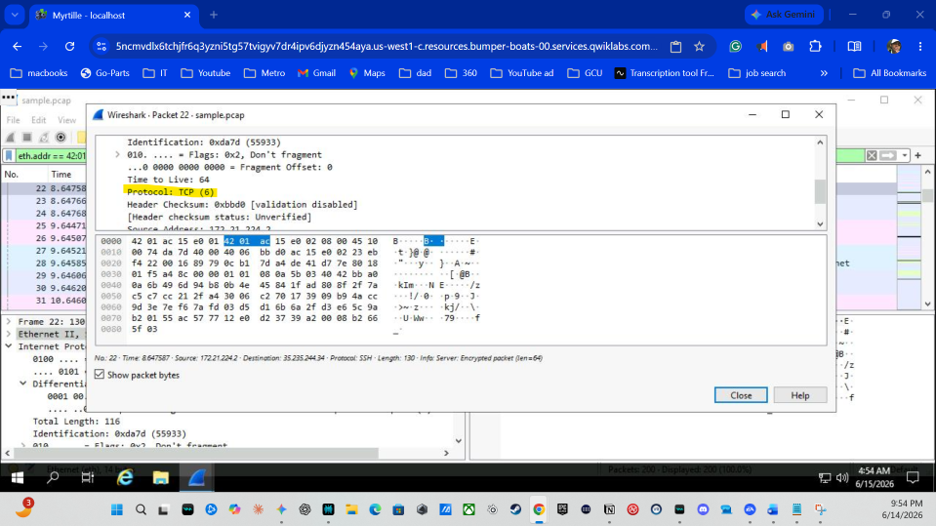

### Question

What protocol is contained in the IPv4 subtree from the first packet related to MAC address 42:01:ac:15:e0:02?

**Answer:** TCP

---

## Task 4. Use filters to explore DNS packets

Apply the following filter:

```text
udp.port == 53
```

**Picture11**
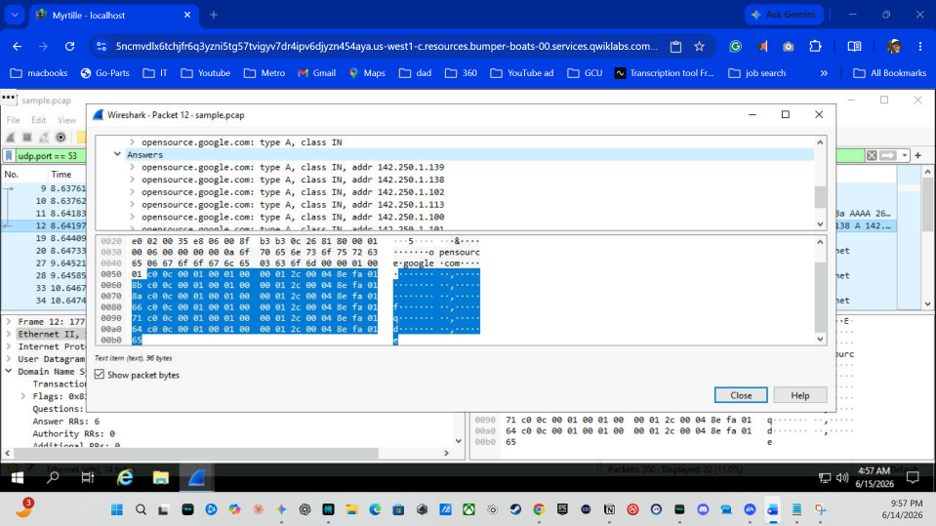

### DNS Query

Queried hostname:

```text
opensource.google.com
```

**Picture12**
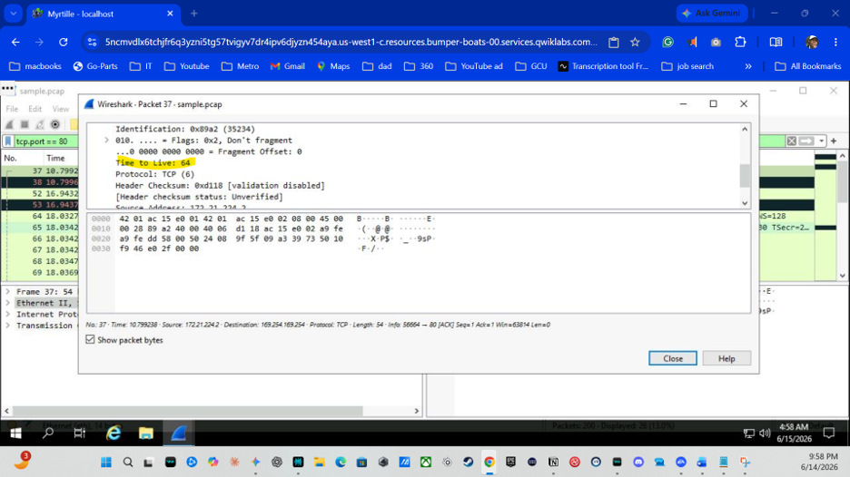

### Question

Which IP address is displayed in the Answers section for opensource.google.com?

**Answer:**

```text
142.250.1.139
```

**Picture13**
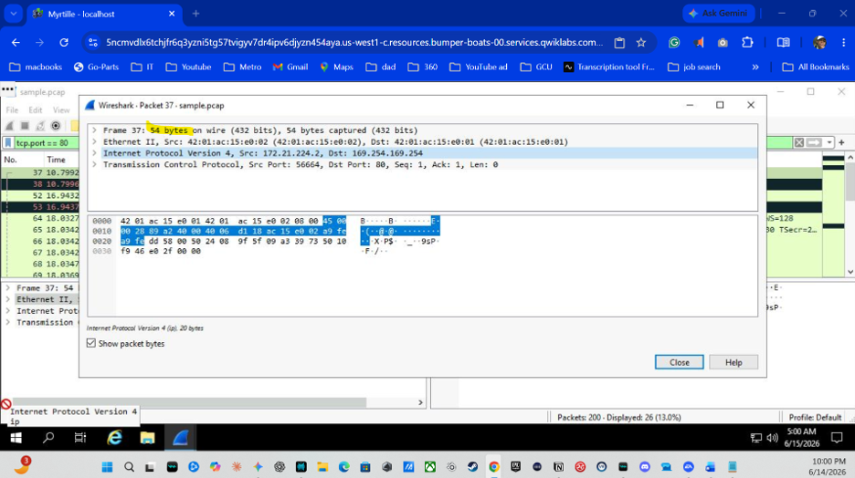

---

## Task 5. Use filters to explore TCP packets

Apply the following filter:

```text
tcp.port == 80
```

**Picture14**
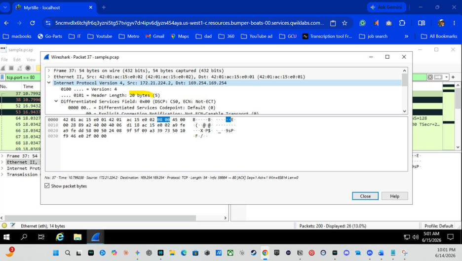

### Questions & Answers

**Time To Live (TTL)**

```text
64
```

**Frame Length**

```text
54 bytes
```

**Header Length**

```text
20 bytes
```

**Destination Address**

```text
169.254.169.254
```

**Picture15**
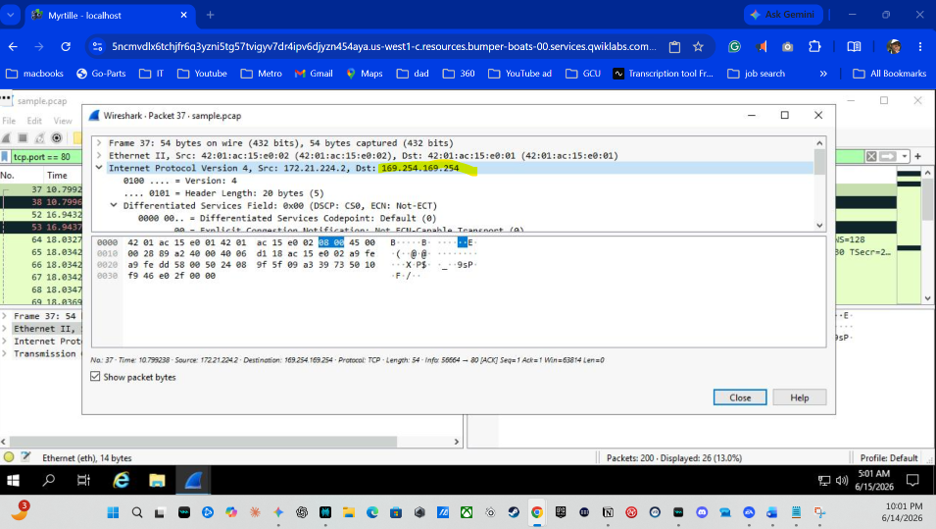

### Filter packets containing text

```text
tcp contains "curl"
```

**Picture16**
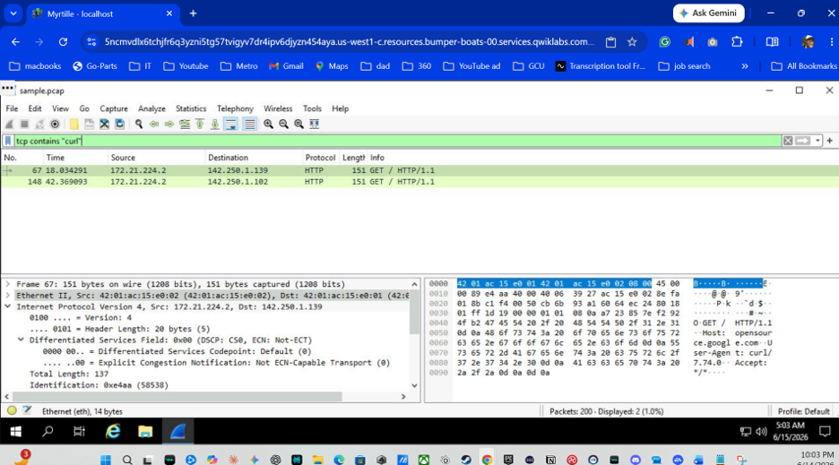

---

## Key Takeaways

- Used Wireshark to analyze packet captures
- Applied display filters to isolate network traffic
- Examined ICMP, TCP, HTTP, and DNS traffic
- Investigated packet details at multiple network layers
- Identified IP addresses, MAC addresses, ports, and DNS responses

## Skills Demonstrated

- Wireshark
- Packet Analysis
- Network Traffic Analysis
- DNS Investigation
- TCP/IP Analysis
- Protocol Analysis
- Cybersecurity Investigation
