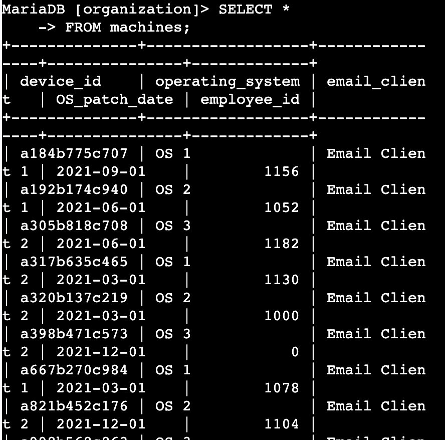
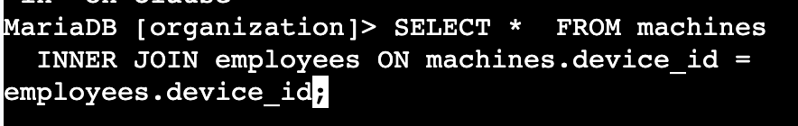
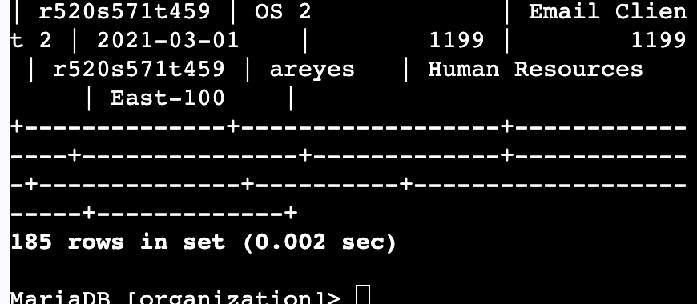
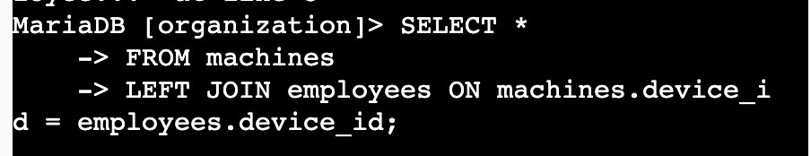
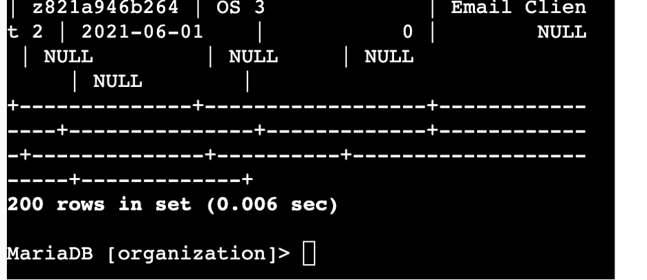
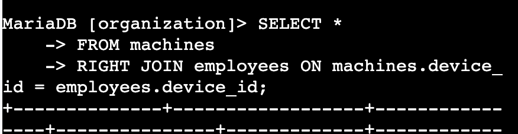
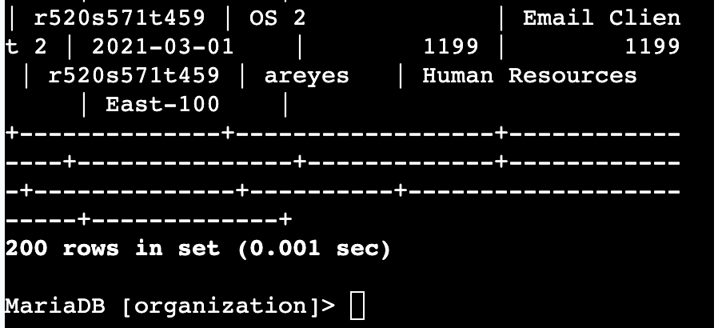
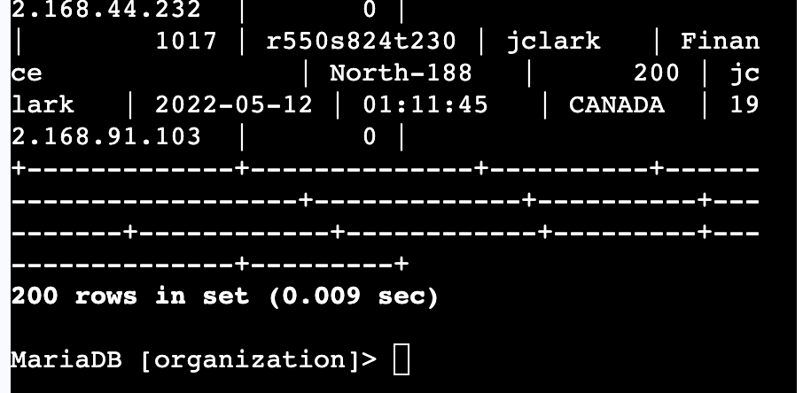

# 🗄️ Complete a SQL Join (MariaDB)
**Platform:** Coursera – Google Cybersecurity Certificate  
**Skill Level:** Introductory  
**Estimated Time:** ~1 hour  

---

## 🧠 Overview

This lab focuses on using SQL joins to combine data across multiple related tables in a MariaDB database. As a security analyst, joining tables is an important skill for correlating users, devices, and login activity during investigations.

In this activity, I used `INNER JOIN`, `LEFT JOIN`, and `RIGHT JOIN` statements to connect employee, machine, and login attempt data. These joins help uncover relationships between assets and user activity, which is essential for security monitoring and incident response.

---

## 🎯 Scenario

In this activity, I queried a database to:

- Match employees to the machines assigned to them
- Return all machines and their associated employees
- Return all employees, including those without assigned machines
- Retrieve all employees who made login attempts

These tasks simulate real-world security work such as asset tracking, account investigations, and login correlation.

---

## 🛠️ SQL Concepts Used

- `SELECT`
- `FROM`
- `INNER JOIN`
- `LEFT JOIN`
- `RIGHT JOIN`
- Join conditions with `ON`
- Common key columns (`device_id`, `username`)

---

## 📝 Task Breakdown & Evidence

---

## 🔹 Task 1: Match Employees to Their Machines

**Objective:**  
Use an `INNER JOIN` to return records where employees and machines share the same `device_id`.

**Query Used:**
```sql
SELECT *
FROM machines
INNER JOIN employees ON machines.device_id = employees.device_id;
```

**Evidence:**





**Result:**  
The inner join returned **185 rows**.

**Security Relevance:**  
Correlating employees with assigned machines supports asset accountability and helps investigators determine who is using a specific system.

---

## 🔹 Task 2: Return More Data with LEFT JOIN and RIGHT JOIN

### LEFT JOIN: Return All Machines and Matching Employees

**Objective:**  
Retrieve all records from the `machines` table, including machines that may not currently be assigned to an employee.

**Query Used:**
```sql
SELECT *
FROM machines
LEFT JOIN employees ON machines.device_id = employees.device_id;
```

**Evidence:**





**Result:**  
The value in the `username` column for the last record returned was **NULL**.

**Security Relevance:**  
This helps identify devices that exist in inventory but may not have a current assigned owner.

---

### RIGHT JOIN: Return All Employees and Any Assigned Machines

**Objective:**  
Retrieve all records from the `employees` table, including employees who may not currently have an assigned machine.

**Query Used:**
```sql
SELECT *
FROM machines
RIGHT JOIN employees ON machines.device_id = employees.device_id;
```

**Evidence:**





**Result:**  
The value in the `username` column for the last record returned was **areyes**.

**Security Relevance:**  
This helps identify employees who may need equipment assigned or whose records require review.

---

## 🔹 Task 3: Retrieve Login Attempt Data

**Objective:**  
Use an `INNER JOIN` to return employees who made login attempts by joining `employees` and `log_in_attempts` on the `username` column.

**Query Used:**
```sql
SELECT *
FROM employees
INNER JOIN log_in_attempts ON employees.username = log_in_attempts.username;
```

**Evidence:**





**Result:**  
This inner join returned **200 records**.

**Security Relevance:**  
Joining user and login activity data is critical for detecting suspicious authentication patterns and investigating account activity.

---

## ✅ Key Takeaways

- SQL joins allow analysts to correlate data across multiple tables
- `INNER JOIN` returns only matching records
- `LEFT JOIN` and `RIGHT JOIN` help identify missing relationships
- Joining employee, machine, and login data improves security visibility

---

## 📌 Skills Demonstrated

- SQL join operations  
- Data correlation across tables  
- Asset-to-user mapping  
- Login activity analysis  
- Database investigation techniques  

---

## 📂 Repository Structure

```text
complete-sql-join-lab/
│
├── README.md
└── images/
    ├── Picture1.png
    ├── Picture2.png
    ├── Picture3.png
    ├── Picture4.png
    ├── Picture5.png
    ├── Picture6.png
    ├── Picture7.png
    └── Picture8.png
```

