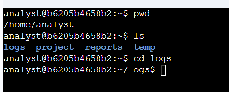
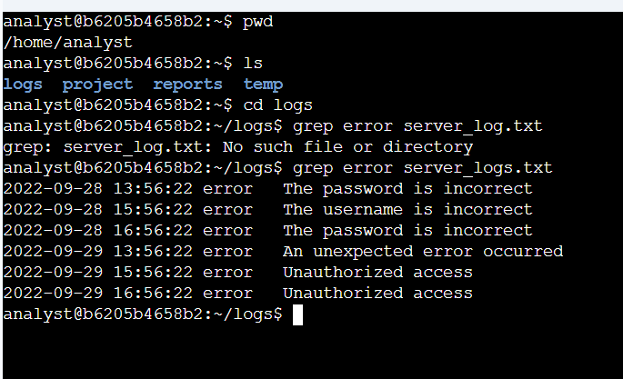
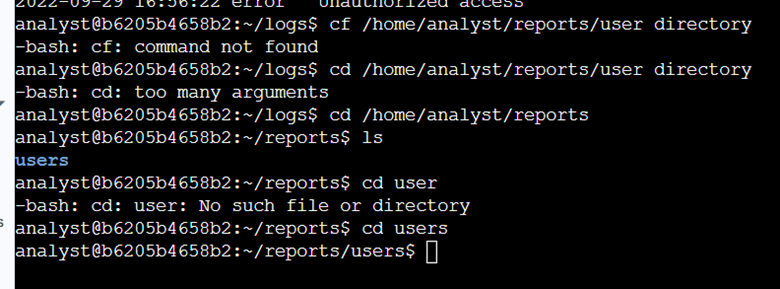
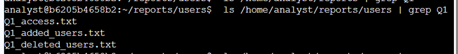
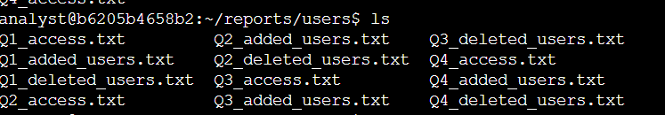

# 📁 Filter Data with grep (Linux)

**Platform:** Coursera – Google Cybersecurity Certificate
**Skill Level:** Introductory

---

## 🧠 Overview

This lab focuses on using the `grep` command and piping in Linux to efficiently search files and filter relevant information. As a cybersecurity analyst, the ability to quickly locate specific strings in logs and user data files is critical during investigations, log reviews, and incident response.

---

## 🎯 Scenario

In this activity, I was tasked with obtaining information from server log files and user data files. This included filtering error messages from logs, identifying files with specific naming patterns, and searching user files for particular usernames.

---

## 🛠️ Tools & Commands Used

* `cd`
* `ls`
* `grep`
* Pipe operator `|`

---

## 📝 Task Breakdown & Evidence

---

## 🔹 Task 1: Search for Error Messages in a Log File

**Objective:**
Locate and display only error-related entries from a server log file.

**Commands Used:**

```bash
cd /home/analyst/logs
grep error server_logs.txt
```

**Evidence:**



**Explanation:**
The `grep error` command filters the `server_logs.txt` file and returns only log entries containing the string `error`. This allows analysts to quickly focus on potential issues without reviewing the entire log file.

**Security Relevance:**
Error logs often reveal authentication failures, system misconfigurations, or indicators of malicious activity.

---

## 🔹 Task 2: Find Files Containing Specific Strings

**Objective:**
Identify user report files containing a specific string in their filenames.

**Commands Used:**

```bash
cd /home/analyst/reports/users
ls | grep Q1
```

**Evidence:**



**Explanation:**
By piping the output of `ls` into `grep`, only files containing `Q1` in their names are displayed. This technique is useful when working with directories that contain many files.

**Security Relevance:**
File naming patterns can indicate reporting periods, access changes, or audit data relevant to investigations.

---

## 🔹 Task 3: Search File Contents for Specific User Information

**Objective:**
Search user data files for a specific username to identify account changes.

**Commands Used:**

```bash
ls
grep jhill Q2_deleted_users.txt
```

**Evidence:**








**Explanation:**
The `grep jhill` command searches the `Q2_deleted_users.txt` file and returns entries related to the specified username, confirming whether the user was removed from the system.

**Security Relevance:**
Reviewing deleted user accounts helps validate proper offboarding and detect unauthorized account removals.

---

## ✅ Key Takeaways

* `grep` is a powerful tool for filtering large datasets
* Piping commands improves efficiency during investigations
* Searching logs and user files is a core SOC responsibility
* Linux text-processing skills support rapid incident response

---

## 📌 Skills Demonstrated

* Linux command-line navigation
* Log filtering and analysis
* Pattern matching with `grep`
* User access investigation

---

## 📂 Repository Structure

```text
filter-with-grep-lab/
│
├── README.md
└── images/
    ├── Picture1.png
    ├── Picture2.png
    ├── Picture3.png
    ├── Picture4.png
    ├── Picture5.png
    └── Pictue6.png
```
