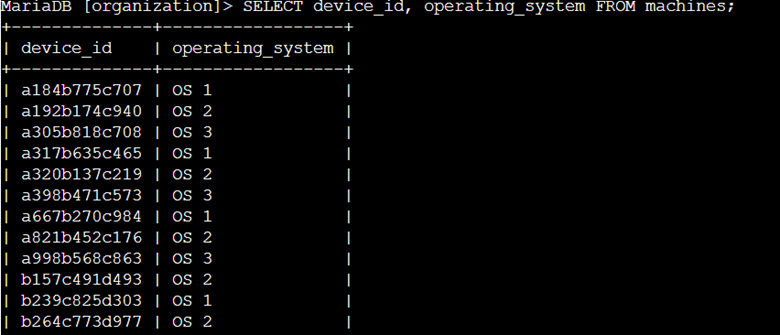
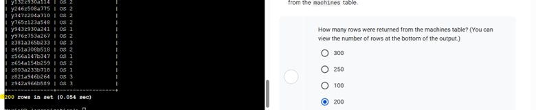
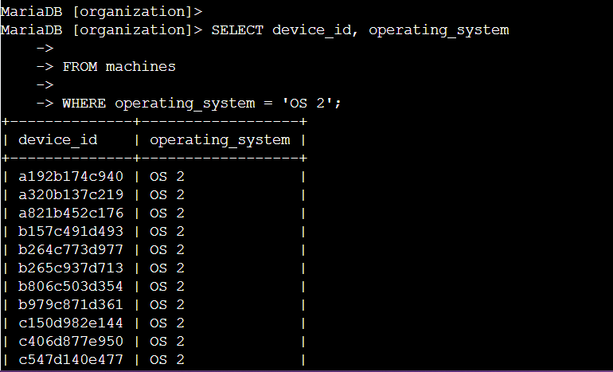
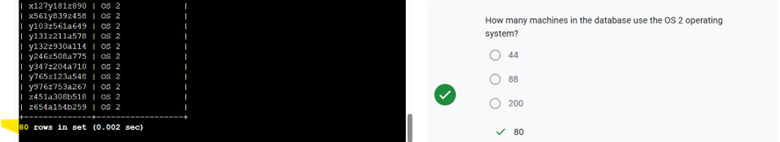
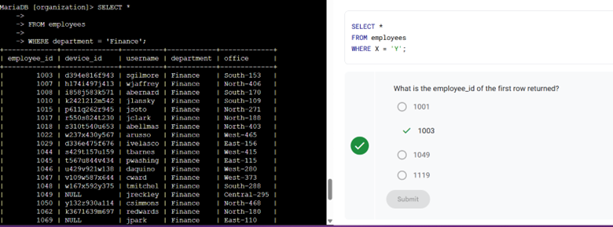
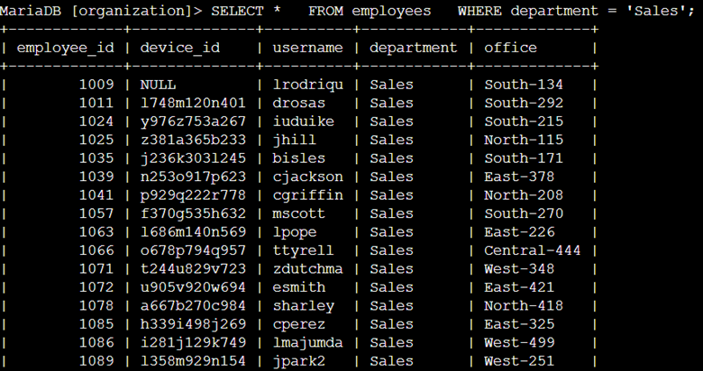
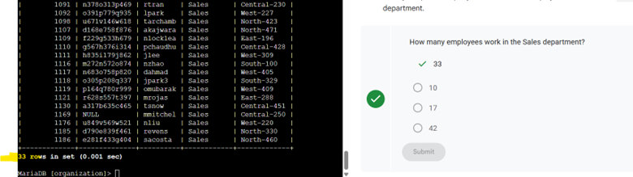
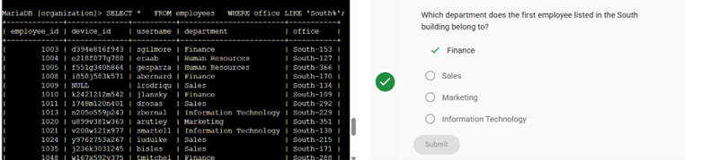

# 🗄️ Filter a SQL Query (MariaDB)
**Platform:** Coursera – Google Cybersecurity Certificate  
**Skill Level:** Introductory  
**Estimated Time:** ~1 hour  

---

## 🧠 Overview

This lab focuses on filtering SQL queries to retrieve specific information from a MariaDB database. As a security analyst, writing efficient queries allows you to quickly locate relevant security data such as employee information, device details, and department assignments.

MariaDB is an open-source relational database compatible with MySQL. Understanding how to filter query results using `WHERE`, comparison operators, and `LIKE` is essential for security investigations and system auditing.

---

## 🎯 Scenario

In this activity, I queried a database to retrieve information about:

- Organization machines and their operating systems
- Machines running a specific operating system
- Employees in specific departments
- Employees assigned to specific office locations

These tasks simulate real-world situations such as running system updates, sending compliance notifications, and identifying users tied to affected machines.

---

## 🛠️ SQL Concepts Used

- `SELECT`
- `FROM`
- `WHERE`
- String comparison
- `LIKE` operator
- Wildcards (`%`)

---

## 📝 Task Breakdown & Evidence

---

## 🔹 Task 1: List All Organization Machines

**Objective:**  
Retrieve all machine IDs and their operating systems from the `machines` table.

**Query Used:**
```sql
SELECT device_id, operating_system
FROM machines;
```

**Evidence:**



**Security Relevance:**  
Identifying all devices and their operating systems supports patch management and vulnerability assessments.

---

## 🔹 Task 2: Retrieve Machines Running 'OS 2'

**Objective:**  
Filter machines that require updates by selecting only those running `'OS 2'`.

**Query Used:**
```sql
SELECT *
FROM machines
WHERE operating_system = 'OS 2';
```

**Evidence:**



**Security Relevance:**  
Targeted filtering enables faster remediation of vulnerable systems.

---

## 🔹 Task 3: List Employees in Specific Departments

### Finance Department

**Query Used:**
```sql
SELECT *
FROM employees
WHERE department = 'Finance';
```

**Evidence:**



---

### Sales Department

**Query Used:**
```sql
SELECT *
FROM employees
WHERE department = 'Sales';
```

**Evidence:**



**Security Relevance:**  
Filtering employees by department helps enforce compliance policies and distribute targeted security communications.

---

## 🔹 Task 4: Identify Employee Machines

### Identify Employee in 'South-109'

**Query Used:**
```sql
SELECT *
FROM employees
WHERE office = 'South-109';
```

**Evidence:**



---

### Identify All Employees in 'South' Building

**Query Used:**
```sql
SELECT *
FROM employees
WHERE office LIKE 'South%';
```

**Evidence:**








**Security Relevance:**  
Using pattern matching allows analysts to identify groups of users affected by building-specific incidents or outages.

---

## ✅ Key Takeaways

- Filtering SQL queries improves investigation efficiency
- The `WHERE` clause narrows down large datasets
- The `LIKE` operator enables flexible pattern matching
- Querying databases is a core skill in security operations and auditing

---

## 📌 Skills Demonstrated

- SQL data retrieval  
- Filtering with `WHERE`  
- Pattern matching with `LIKE`  
- Database investigation techniques  

---

## 📂 Repository Structure

```text
filter-sql-query-lab/
│
├── README.md
└── images/
    ├── Picture1.png
    ├── Picture2.png
    ├── Picture3.png
    ├── Picture4.png
    ├── Picture5.png
    ├── Picture6.png
    ├── Picture7.png
    └── Picture8.png
```

