# 🗄️ Filter with AND, OR, and NOT (SQL)
**Platform:** Coursera – Google Cybersecurity Certificate  
**Skill Level:** Introductory  
**Estimated Time:** ~1 hour  

---

## 🧠 Overview

This lab focused on creating more complex SQL queries using logical operators such as `AND`, `OR`, and `NOT`. As a security analyst, filtering data using multiple conditions is essential for investigating login attempts, identifying suspicious behavior, and retrieving targeted employee or system information.

This activity builds on foundational SQL filtering techniques and applies them to real-world security scenarios.

---

## 🎯 Scenario

In this lab, I retrieved specific information from two database tables:

- `log_in_attempts`
- `employees`

The tasks required filtering login attempts based on time, date, and geographic origin, as well as retrieving employee data based on department and office location.

These types of queries are commonly used in:
- Incident response investigations  
- Access auditing  
- Security monitoring  
- Patch management coordination  

---

## 🛠️ SQL Concepts Used

- `SELECT`
- `FROM`
- `WHERE`
- `AND`
- `OR`
- `NOT`
- `LIKE`
- Wildcard `%`

---

## 📝 Task Breakdown & Evidence

---

## 🔹 Task 1: Retrieve After-Hours Failed Login Attempts

**Objective:**  
Identify unsuccessful login attempts that occurred after 18:00.

**Query Used:**
```sql
SELECT *
FROM log_in_attempts
WHERE login_time > '18:00'
AND success = 0;
```

**Evidence:**

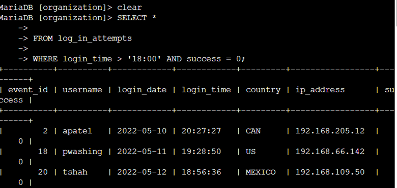

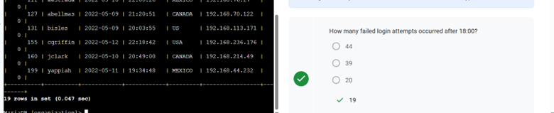

**Security Relevance:**  
Failed login attempts outside business hours may indicate brute-force attempts or unauthorized access.

---

## 🔹 Task 2: Retrieve Login Attempts on Specific Dates

**Objective:**  
Retrieve login attempts that occurred on '2022-05-08' and '2022-05-09'.

**Query Used:**
```sql
SELECT *
FROM log_in_attempts
WHERE login_date = '2022-05-08'
OR login_date = '2022-05-09';
```

**Evidence:**

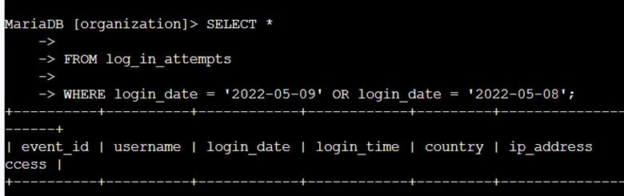

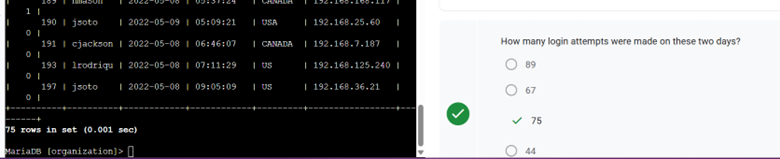

**Security Relevance:**  
Filtering by date helps isolate activity surrounding suspicious events.

---

## 🔹 Task 3: Retrieve Login Attempts Outside of Mexico

**Objective:**  
Identify login attempts that did not originate from Mexico.

**Query Used:**
```sql
SELECT *
FROM log_in_attempts
WHERE NOT country LIKE 'MEX%';
```

**Evidence:**

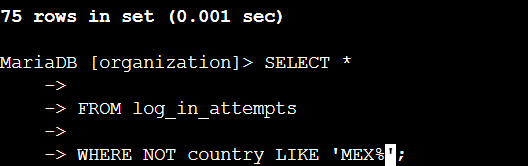

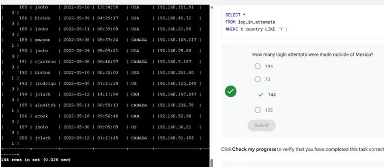

**Security Relevance:**  
Filtering by geographic origin helps detect anomalous or potentially malicious login activity.

---

## 🔹 Task 4: Retrieve Marketing Employees in East Building

**Objective:**  
Retrieve employees in the 'Marketing' department located in offices within the East building.

**Query Used:**
```sql
SELECT *
FROM employees
WHERE department = 'Marketing'
AND office LIKE 'East%';
```

**Evidence:**

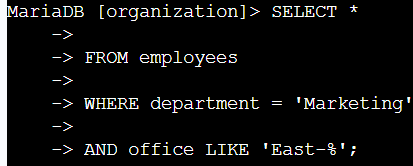

---

## 🔹 Task 5: Retrieve Employees in Finance or Sales

**Objective:**  
Retrieve employees in either the 'Finance' or 'Sales' department.

**Query Used:**
```sql
SELECT *
FROM employees
WHERE department = 'Finance'
OR department = 'Sales';
```

**Evidence:**

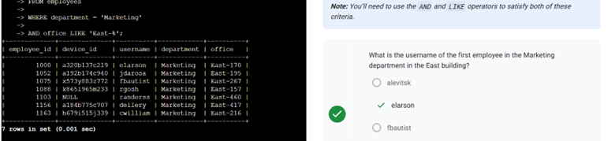

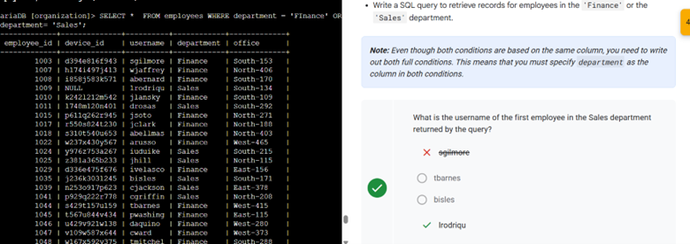

---

## 🔹 Task 6: Retrieve Employees Not in IT

**Objective:**  
Identify employees who are not in the 'Information Technology' department.

**Query Used:**
```sql
SELECT *
FROM employees
WHERE NOT department = 'Information Technology';
```

**Evidence:**

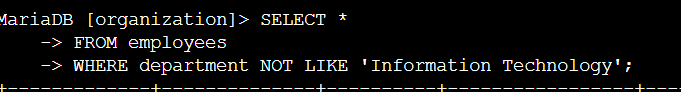

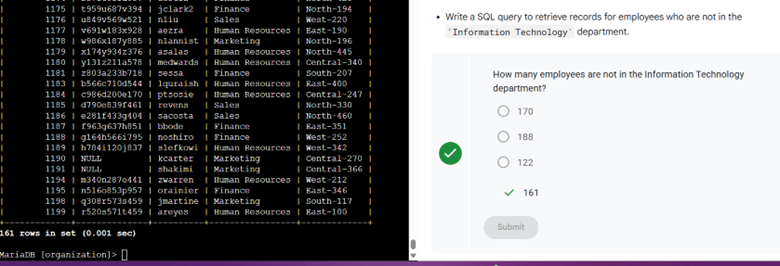

**Security Relevance:**  
Using `NOT` helps isolate users who still require updates when certain departments have already been addressed.

---

## ✅ Key Takeaways

- Logical operators (`AND`, `OR`, `NOT`) allow precise data filtering
- The `LIKE` operator enables flexible pattern matching
- Combining multiple conditions strengthens investigative accuracy
- Efficient SQL querying is essential for security monitoring and response

---

## 📌 Skills Demonstrated

- Advanced SQL filtering  
- Logical condition building  
- Security-focused data retrieval  
- Database investigation techniques  

---

## 📂 Repository Structure

```text
filter-and-or-not-sql-lab/
│
├── README.md
└── images/
    ├── Picture1.png
    ├── Picture2.png
    ├── Picture3.png
    ├── Picture4.png
    ├── Picture5.png
    ├── Picture6.png
    ├── Picture7.png
    ├── Picture8.png
    ├── Picture9.png
    ├── Picture10.png
    └── Picture11.png
```

---

*Lab based on Coursera activity: Filter with AND, OR, and NOT* fileciteturn7file0

