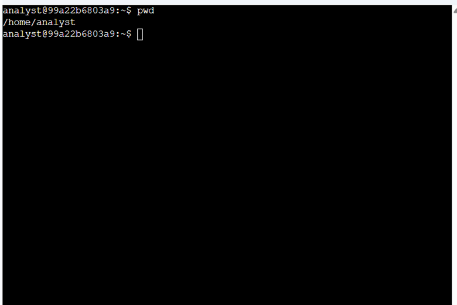
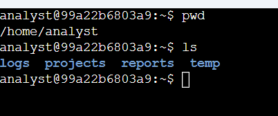
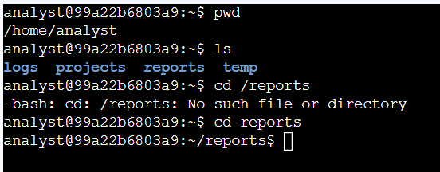
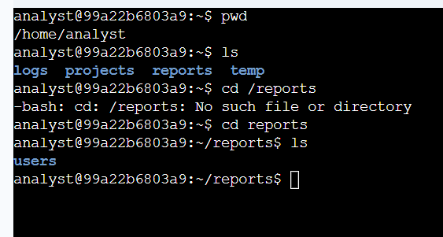
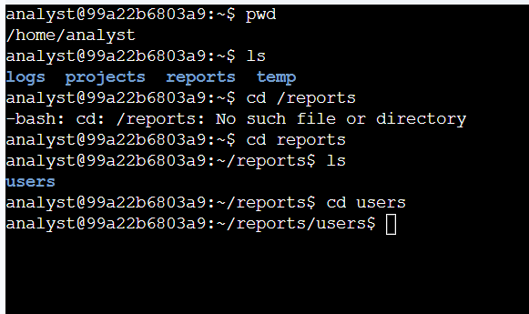
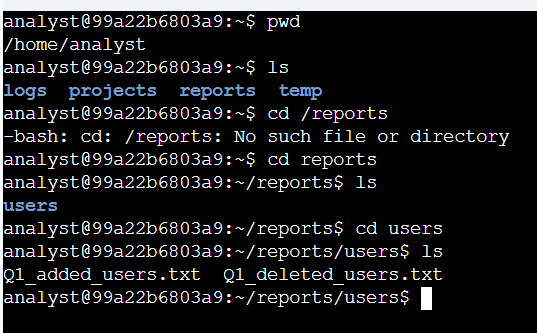
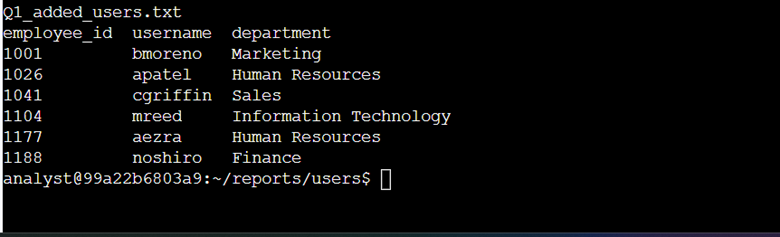
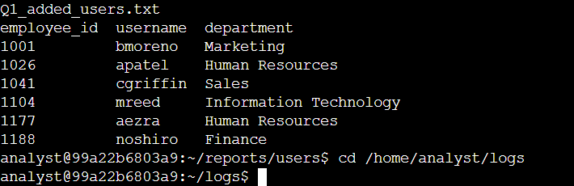
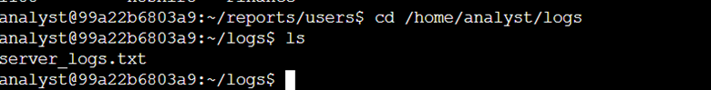
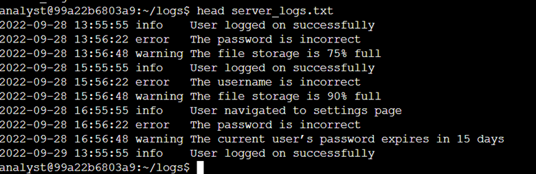

# 📁 Find Files with Linux Commands  
**Platform:** Coursera – Google Cybersecurity Certificate  
**Skill Level:** Introductory  

---

## 🧠 Overview

This lab demonstrates foundational Linux command-line skills used by cybersecurity analysts to navigate directories, locate files, and analyze file contents without a graphical user interface. These skills are commonly used in SOC operations, incident response, and forensic investigations.

---

## 🎯 Scenario

The task was to locate and analyze files within the `/home/analyst` directory. This included navigating through subdirectories, reviewing user-related reports, and examining system log files using Linux shell commands.

---

## 🛠️ Tools & Commands Used

- `pwd`
- `ls`
- `cd`
- `cat`
- `head`

---

## 📝 Task Breakdown & Evidence

---

## 🔹 Task 1: Get Current Directory Information

**Commands Used:**
```bash
pwd
ls
```

**Evidence:**





**Explanation:**  
The `pwd` command confirms the current directory is `/home/analyst`.  
The `ls` command lists available directories including `logs`, `projects`, `reports`, and `temp`.

---

## 🔹 Task 2: Change Directory and List Subdirectories

**Commands Used:**
```bash
cd reports
ls
```

**Evidence:**





**Explanation:**  
After correcting an initial path error, the `reports` directory was accessed successfully, revealing the `users` subdirectory.

---

## 🔹 Task 3: Locate and Read a User Report File

**Commands Used:**
```bash
cd users
ls
cat Q1_added_users.txt
```

**Evidence:**





**Explanation:**  
The report displays newly added user accounts along with employee IDs and assigned departments.

---

## 🔹 Task 4: Navigate to Logs and Examine Log Data

**Commands Used:**
```bash
cd /home/analyst/logs
ls
head server_logs.txt
```

**Evidence:**









**Explanation:**  
The logs show successful logins, authentication failures, and system warnings, which are critical indicators during security investigations.

---

## ✅ Key Takeaways

- Linux CLI navigation is essential for cybersecurity analysts
- Reviewing user and log files helps identify access issues
- Commands like `cat` and `head` enable fast file analysis
- Accurate directory navigation prevents investigative errors

---

## 📌 Skills Demonstrated

- Linux file system navigation  
- Command-line file analysis  
- User access review  
- Log analysis fundamentals  

---

## 📂 Repository Structure

```text
linux-file-navigation-lab/
│
├── README.md
└── images/
    ├── Picture1.png
    ├── Picture2.png
    ├── Picture3.png
    ├── Picture4.png
    ├── Picture5.png
    ├── Picture6.png
    ├── Picture7.png
    ├── Picture8.png
    ├── Picture9.png
    └── Picture10.png
```
