# 📁 Manage Files with Linux Commands  
**Platform:** Coursera – Google Cybersecurity Certificate  
**Skill Level:** Introductory  
**Estimated Time:** ~1 hour  

---

## 🧠 Overview

This lab focuses on managing files and directories in a Linux environment using core command-line tools. As a cybersecurity analyst, organizing, modifying, and maintaining directory structures is a critical skill for managing logs, reports, and investigation artifacts securely and efficiently.

---

## 🎯 Scenario

In this activity, I was tasked with reorganizing the `/home/analyst` directory to improve structure and maintainability. This involved creating and removing directories, moving and deleting files, and documenting completed actions using the `nano` text editor.

The goal was to transform an unorganized directory structure into a clean, standardized layout suitable for secure operations and reporting.

---

## 🛠️ Tools & Commands Used

- `pwd`
- `ls`
- `cd`
- `mkdir`
- `rm` / `rm -r`
- `mv`
- `touch`
- `nano`
- `cat`
- `clear`

---

## 📝 Task Breakdown & Evidence

---

## 🔹 Task 1: Create a New Directory

**Objective:**  
Create a new `logs` directory under `/home/analyst`.

**Commands Used:**
```bash
mkdir logs
ls
```

**Evidence:**


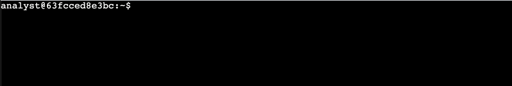


**Security Relevance:**  
Separating log files into a dedicated directory improves monitoring, access control, and investigation workflows.

---

## 🔹 Task 2: Remove an Unused Directory

**Objective:**  
Remove the obsolete `temp` directory.

**Commands Used:**
```bash
rm -r temp
ls
```

**Evidence:**

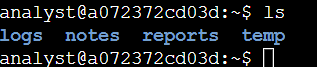

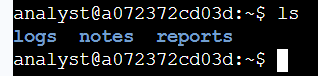

**Security Relevance:**  
Removing unused directories reduces clutter and limits potential locations for malicious or unauthorized files.

---

## 🔹 Task 3: Move a File

**Objective:**  
Move `Q3patches.txt` from the `notes` directory to the `reports` directory.

**Commands Used:**
```bash
cd notes
mv Q3patches.txt ../reports
ls ../reports
```

**Evidence:**

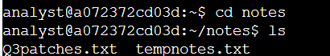
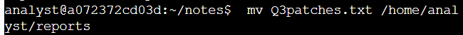
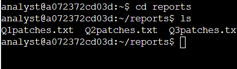

**Security Relevance:**  
Proper file placement ensures patch documentation is stored with other official reports for auditing and compliance.

---

## 🔹 Task 4: Remove an Unused File

**Objective:**  
Delete the unused `tempnotes.txt` file.

**Commands Used:**
```bash
rm tempnotes.txt
ls
```

**Evidence:**

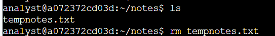
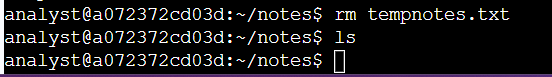
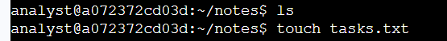

**Security Relevance:**  
Removing outdated notes prevents confusion and reduces the risk of referencing incorrect information during investigations.

---

## 🔹 Task 5: Create a New File

**Objective:**  
Create a new file named `tasks.txt` in the `notes` directory.

**Commands Used:**
```bash
touch tasks.txt
ls
```

**Evidence:**

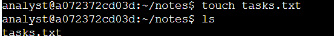
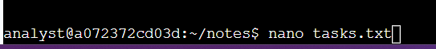

**Security Relevance:**  
Documenting actions taken during system changes supports accountability and audit readiness.

---

## 🔹 Task 6: Edit a File Using nano

**Objective:**  
Edit `tasks.txt` and document completed tasks.

**Commands Used:**
```bash
nano tasks.txt
cat tasks.txt
```

**Evidence:**

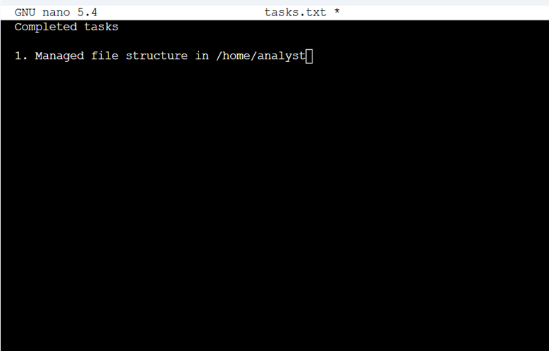
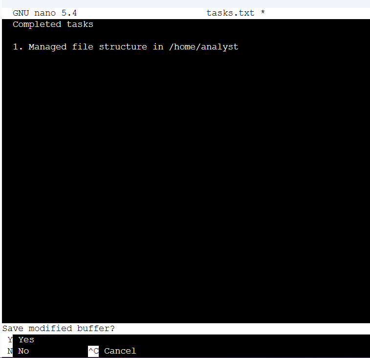
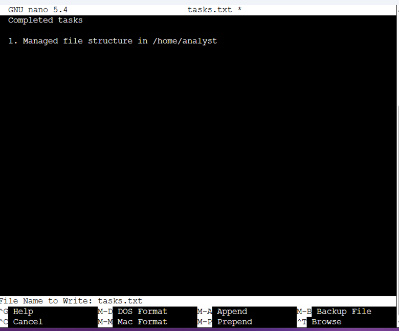
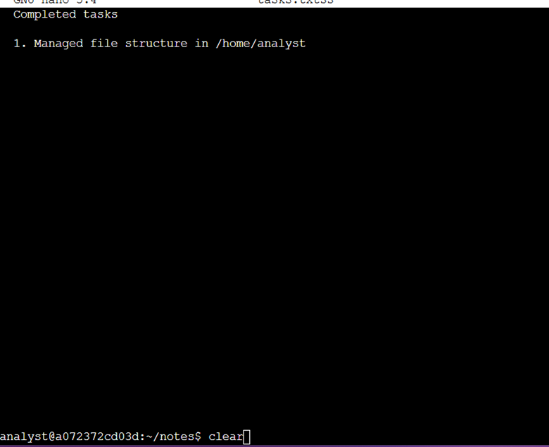
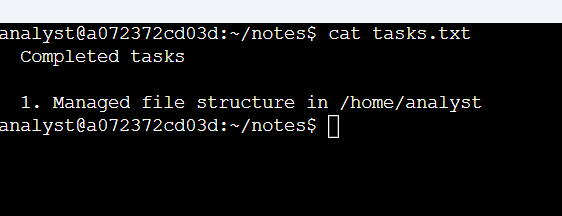

**Security Relevance:**  
Maintaining written documentation of administrative actions supports incident response, change management, and compliance requirements.

---

## ✅ Key Takeaways

- Directory and file management is a core Linux skill for security analysts
- Organized file structures improve investigation efficiency
- Editing and documenting changes ensures accountability
- Command-line tools enable secure system administration

---

## 📌 Skills Demonstrated

- Linux directory management  
- File creation, deletion, and movement  
- Text editing with nano  
- Change documentation and validation  

---

## 📂 Repository Structure

```text
manage-files-linux-lab/
│
├── README.md
└── images/
    ├── Picture1.png
    ├── Picture2.png
    ├── Picture3.png
    ├── Picture4.png
    ├── Picture5.png
    ├── Picture6.png
    ├── Picture7.png
    ├── Picture8.png
    ├── Picture9.png
    ├── Picture10.png
    ├── Picture11.png
    ├── Picture12.png
    ├── Picture13.png
    ├── Picture14.png
    ├── Picture15.png
    ├── Picture16.png
    ├── Picture17.png
    ├── Picture18.png
    └── Picture19.png
```

