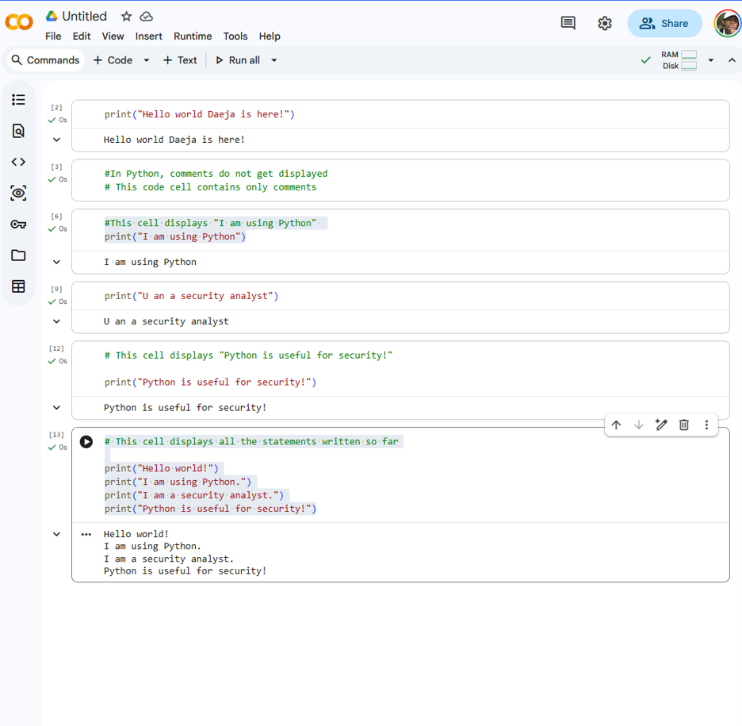

# Activity: Practice Writing Python Code

## Introduction

Python is a programming language that helps in automating instructions to the computer in a variety of contexts, including security contexts. Writing code in Python is a valuable skill that helps security analysts thrive in their technical work.

In this lab, I practiced writing my first Python code while learning about a notebook environment. The hands-on practice helps apply Python coding skills to work as a security analyst.

---

## Scenario

As a security analyst, I'll often use notebook environments and notebooks to write and run code. This lab helped me get familiar with working in a notebook environment, writing code comments in Python, and displaying strings with the `print()` function.

In this lab, I completed a series of tasks that involved observing and running pre-written cells of text and code, as well as filling in cells with my own text, Python code, and code comments.

---

## Task 1

The lab environment is a notebook-based coding environment. Notebooks consist of two types of cells:

1. Text cells, also known as markdown cells
2. Code cells

Markdown cells allow you to write plain text and format it in the markdown language. Markdown can be used to make headers, bold or italicize words, format text as code, add hyperlinks, and more.

For this task, I wrote my own text into a markdown cell and used `Shift + Enter` to display it.

---

## Task 2

In Python notebooks, code cells allow you to write code comments and code in Python.

For this task, I ran the following code cell and observed the output:

```python
# This cell displays "Hello world!"
print("Hello world!")
```

### Question 1

**What do you observe about the output after you ran the code cell?**

It creates another cell after I press `Shift + Enter`, and it displays the text.

---

## Task 3

Writing code comments is a way to document the intention behind code. It's a standard that analysts commonly use in their workflow. Comments make it easier for you and your team to read and revisit code to understand what it does and why certain approaches were taken.

For this task, I ran the following code cell:

```python
# In Python, comments do not get displayed
# This code cell contains only comments
```

### Question 2

**What do you observe about the output after you ran the cell above?**

It does not display the text since it is a comment.

---

## Task 4

For this task, I added a comment at the beginning of the code cell describing what the code is doing.

```python
# This cell displays "I am using Python"
print("I am using Python")
```

### Question 3

**What do you observe about the output after you ran the cell above?**

Python ignores comments during code execution. Code comments aren't interpreted by computers; they're interpreted by analysts.

---

## Task 5

In Python, `print()` helps display information to the screen.

For this task, I used `print()` to display the message:

```python
print("I am a security analyst")
```

### Question 4

**What do you observe about the output after you ran the cell above?**

The output is:

```text
I am a security analyst
```

The quotes around a string do not appear in the output when the string is displayed.

---

## Task 6

For this task, I wrote a `print()` statement to display the string `"Python is useful for security!"`.

```python
# This cell displays "Python is useful for security!"
print("Python is useful for security!")
```

### Question 5

**What do you observe about the output after you ran the cell above?**

The output is:

```text
Python is useful for security!
```

The quotes around a string do not appear in the output when the string is displayed.

---

## Task 7

For the final task, I combined all the `print()` statements encountered and written in this lab into one code cell.

```python
# This cell displays all the statements written so far
print("Hello world!")
print("I am using Python.")
print("I am a security analyst.")
print("Python is useful for security!")
```

### Question 6

**What do you observe about the output after you ran the cell above?**

Each line in the output resulted from a `print()` statement:

```text
Hello world!
I am using Python.
I am a security analyst.
Python is useful for security!
```

Python interprets and executes code in order, from top to bottom and left to right.

---

## Lab Evidence

The completed notebook shows the Python code, comments, and output from the lab.

**Picture1 — Completed Python Notebook**



---

## Conclusion

### What are your key takeaways from this lab?

It's helpful to use code comments to document the decisions you make as you code. Code comments are ignored by computers; they're read by you and your team to understand the intentions behind the code.

Comments in Python use the hash symbol (`#`).

The `print()` function can be used to display information to the screen. When `print()` displays a string, the quotes around the string do not appear in the output.

---

## Skills Practiced

- Python Fundamentals
- Python Comments
- `print()` Statements
- Notebook Environments
- Markdown Cells
- Code Cells
- Basic Python Syntax
- Security Automation Foundations
