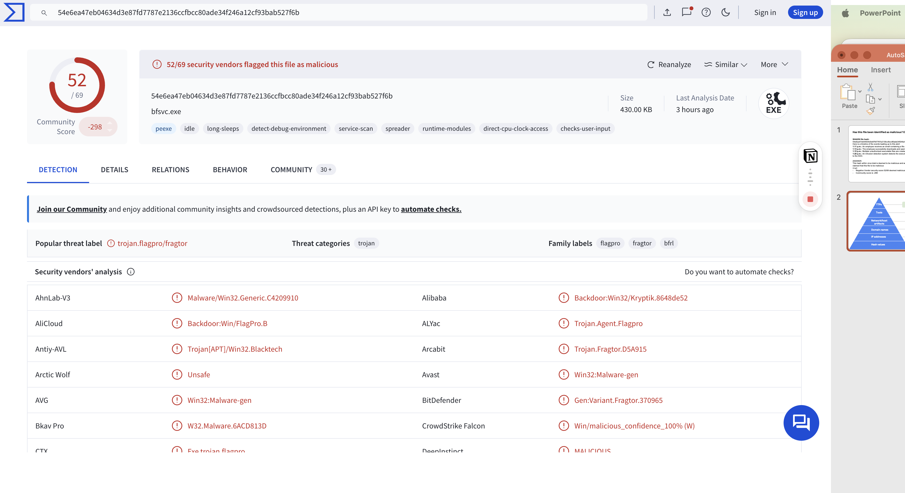

# Activity: Investigate a Suspicious File Hash

## Activity Overview

In this activity, I investigated a suspicious file hash to determine whether a downloaded file was malicious. The investigation included reviewing the timeline of events, analyzing VirusTotal results, and identifying indicators of compromise (IOCs).

---

## Scenario

An employee received an email containing a file attachment.

### Timeline of Events

| Time | Event |
|--------|---------|
| 1:11 PM | Employee receives email with attachment |
| 1:13 PM | Employee downloads and opens the file |
| 1:15 PM | Multiple unauthorized executable files are created |
| 1:20 PM | Intrusion Detection System (IDS) generates an alert |

---

## Investigation

### SHA256 File Hash

```text
54e6ea47eb04634d3e87fd7787e2136ccfbcc80ade34f246a12cf93bab527f6b
```

### Analysis

The file was identified as malicious because 52 out of 69 antivirus vendors flagged it as malware. Several vendors classified the file as:

- Trojan
- Backdoor
- FlagPro
- Fragtor

VirusTotal also reported suspicious behaviors including:

- Service scanning
- Anti-debugging techniques
- Spreading capabilities

These findings provide strong evidence that the file is malicious.

---

## Threat Intelligence

### TTPs

- Detect Debug Environment
- Service Scan
- Spreader

### Host Artifacts

```text
bfsvc.exe
dwm.bin
main.bin
production.bat
```

### Domains

```text
adservice.google.com
apis.google.com
api.bing.com
any.edge.bing.com
a0003.a-msedge.net
```

### IP Addresses

```text
104.115.151.81
104.117.234.151
104.125.90.151
104.86.229.106
```

---

## Evidence

**Picture1 - Suspicious File Hash Investigation**  


---

## Conclusion

Based on the VirusTotal results, behavioral indicators, and malware classifications, the file was determined to be malicious. The investigation identified multiple indicators of compromise and suspicious behaviors that warrant immediate containment and remediation actions.

---

## Skills Demonstrated

- Threat Intelligence Analysis
- Malware Investigation
- VirusTotal Analysis
- Hash Analysis
- IOC Identification
- Incident Investigation
- Security Operations (SOC)
