# IBM Hands-on Lab: Enforce Strong Password Policies

## About This Lab

...

## Exercise 1: Check Password Strength

### Test Password: fido1973

**Picture1**
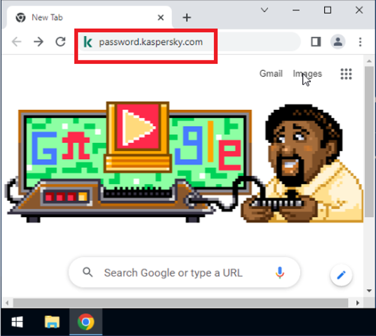

### Test Password: Fido1973!

**Picture2**
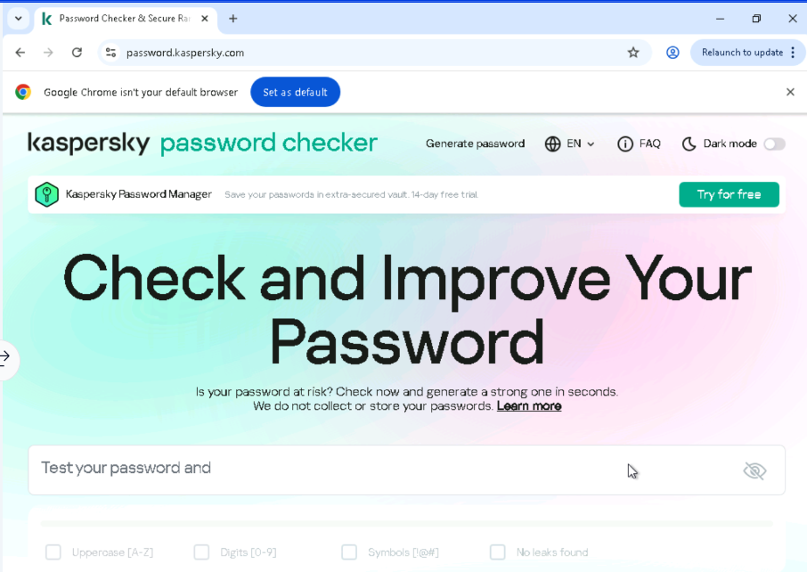

### Test Password: Mh1llifwwas!

**Picture3**
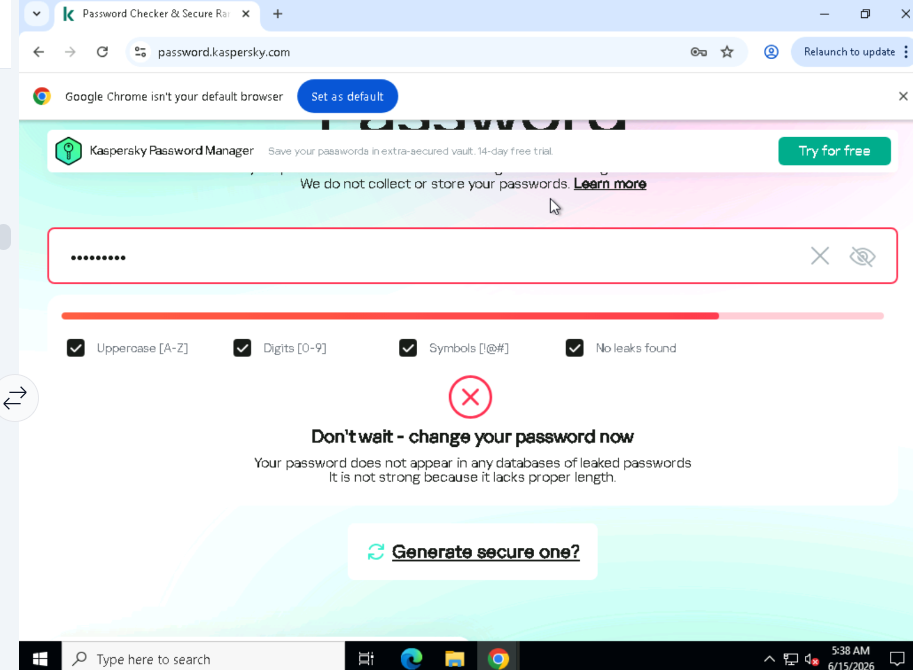

---

## Exercise 2: Review Windows Local Group Policy Editor

### Open Command Prompt

**Picture4**
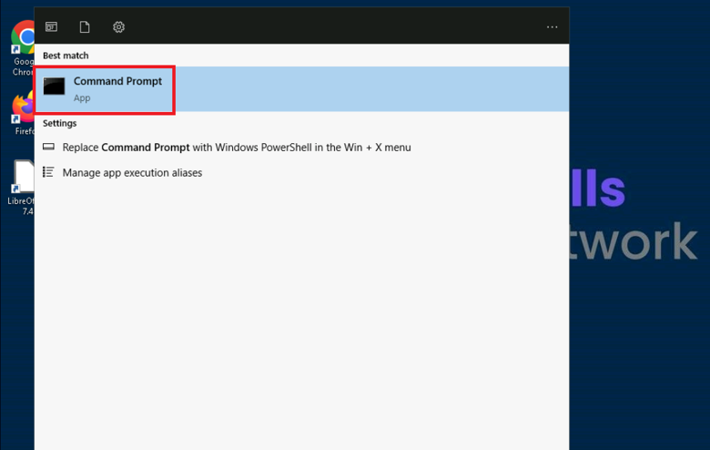

### Launch gpedit

**Picture5**
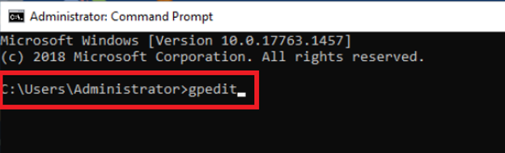

### Local Group Policy Editor

**Picture6**
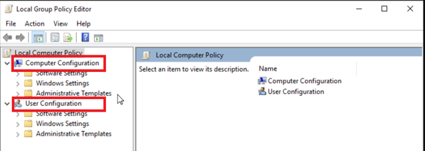

### Navigate to Account Policies

**Picture7**
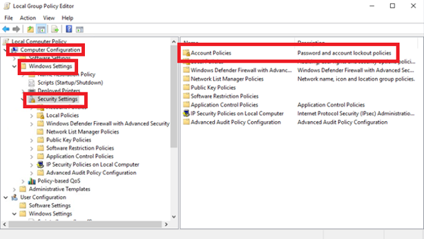

### Password Policy Settings

**Picture8**
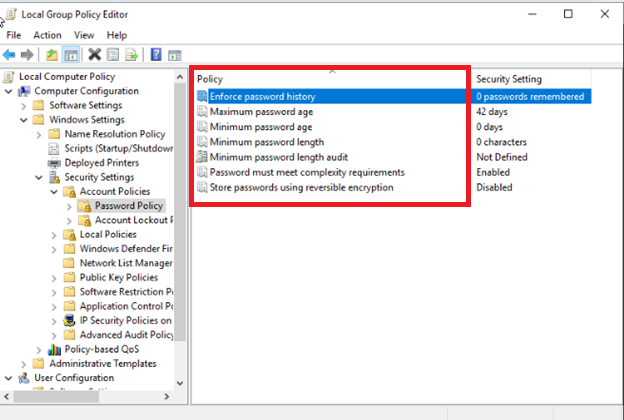

---

## Exercise 3: Configure Password Policies

### Enforce Password History

**Picture9**
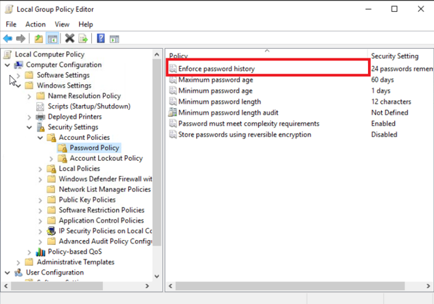

### Configure Password History

**Picture10**
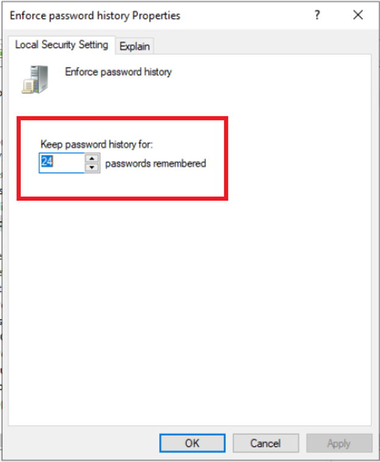

### Maximum Password Age

**Picture11**
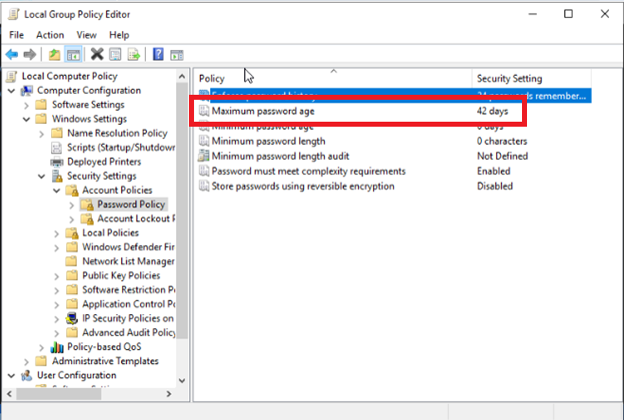

### Configure Maximum Password Age

**Picture12**
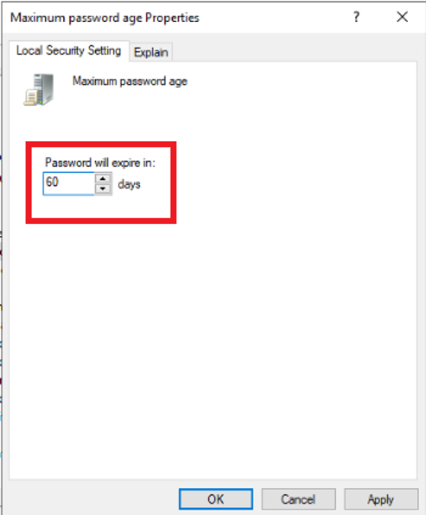

### Minimum Password Age

**Picture13**
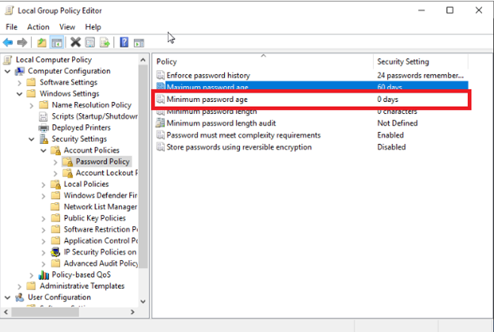

### Configure Minimum Password Age

**Picture14**
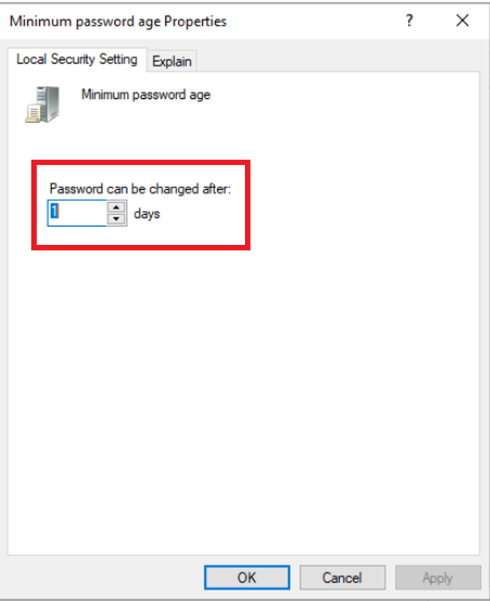

### Minimum Password Length

**Picture15**
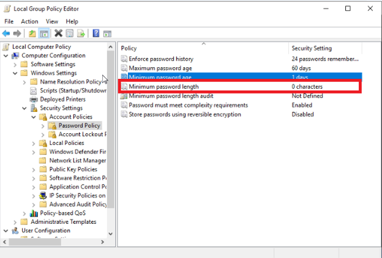

### Configure Minimum Password Length

**Picture16**
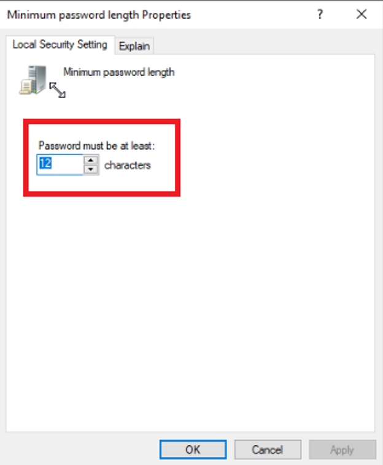

### Review Updated Policy Settings

**Picture17**
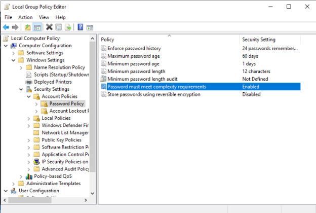

---

## Practice Exercise

### Create a Complex Password

**Picture18**
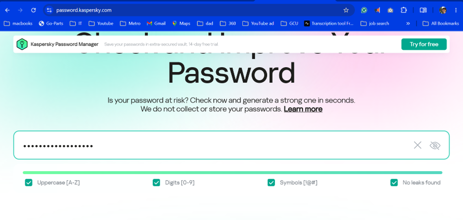

### Password Complexity Requirements

**Picture19**
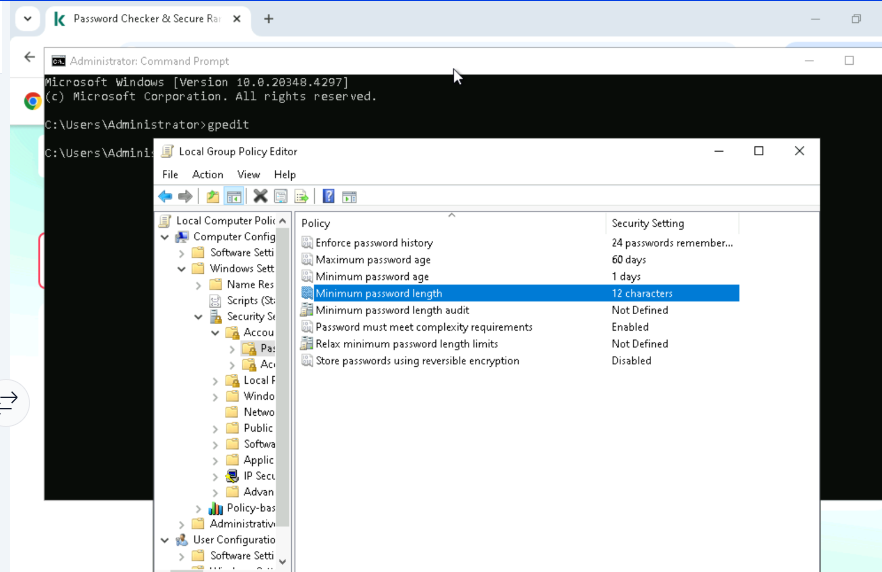
