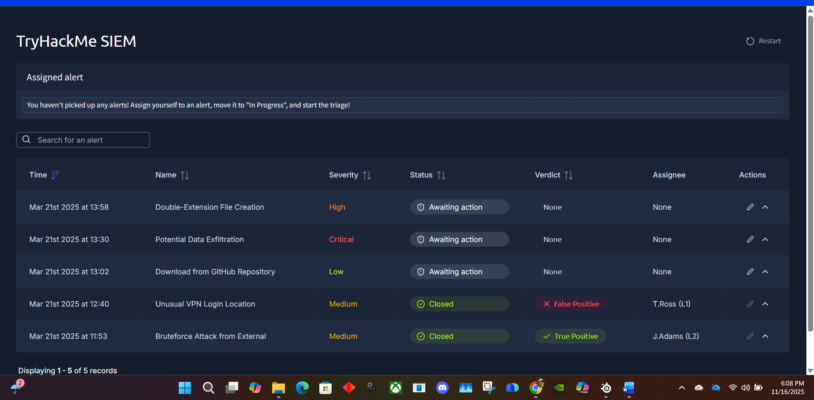
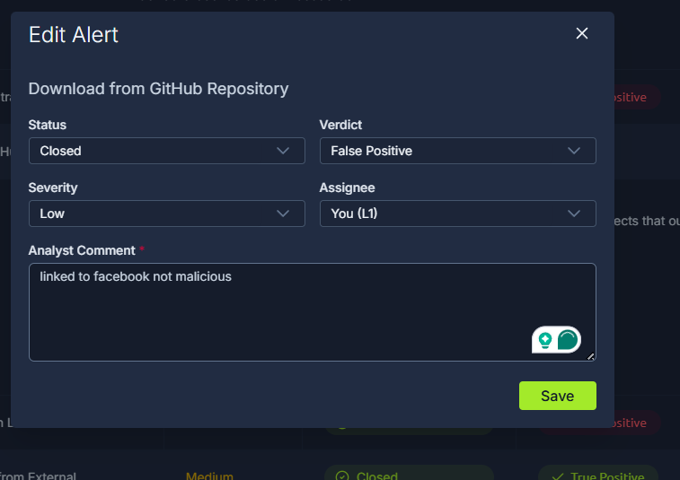
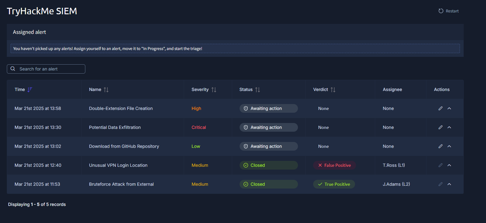
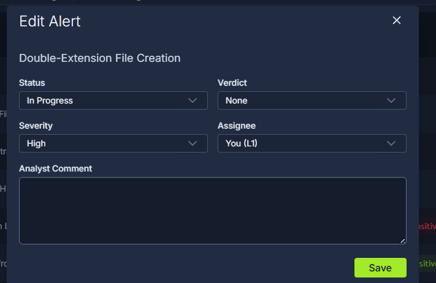
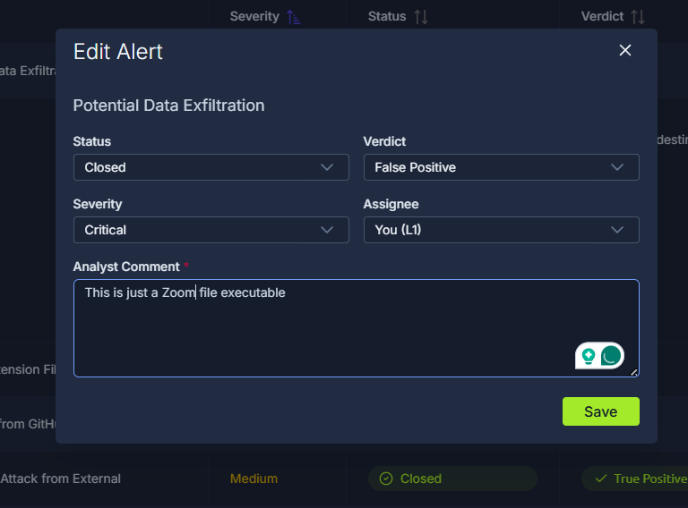
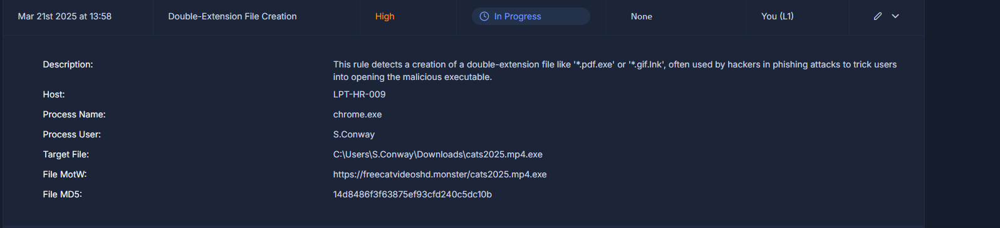

# 🛡️ TryHackMe — SOC L1 Alert Triage  
### *Alert Lifecycle • Triage Workflow • L1 Analyst Skills*

This document contains my write-up and answers for the **TryHackMe SOC L1 Alert Triage** lab.  
This room teaches the fundamentals of alert handling, triage decision-making, workflow best practices, and analyst responsibilities inside a SOC.

---

# 🔹 **Task 1 — Introduction**

Alerts notify analysts of suspicious or malicious activity based on event patterns inside the SIEM.

Below is the SOC dashboard showing the alerts count:



### **Learning Objectives**
- Understand SOC alert concepts  
- Learn alert lifecycle and triage process  
- Recognize alert fields, statuses, severity, and classification  
- Build SOC L1 triage skills  
- Prepare for SOC simulator and SAL1 certification  

### **Questions**
**What is the number of alerts you see in the SOC dashboard?**  
✔️ **5**

**What is the name of the most recent alert you see?**  
✔️ **Double-Extension File Creation**

---

# 🔹 **Task 2 — Events and Alerts**

These screenshots show event → alert transitions and how alerts are displayed:



Events become alerts after:
- Logging  
- SIEM ingestion  
- Detection rule matching  

### L1 SOC Responsibilities
- Review alerts  
- Distinguish false positives vs real threats  
- Escalate when necessary  
- Document findings  

### **Questions**
**What was the verdict for the “Unusual VPN Login Location” alert?**  
✔️ **False Positive**


**What user was mentioned in the alert?**  
✔️ **M.Clark**

---

# 🔹 **Task 3 — Alert Properties**

Alerts typically include:
- **Alert Time**  
- **Event Time**  
- **Name**  
- **Severity**  
- **Status**  
- **Verdict**  
- **Assignee**  
- **Description**  
- **Fields / IOCs**  



### **Questions**
**Should you first prioritize medium over low severity alerts?**  
✔️ **Yea**

**Should you first take the newest alerts?**  
✔️ **Nay**

**Name of the first-priority alert you assigned yourself:**  
✔️ **Potential Data Exfiltration**

---

# 🔹 **Task 4 — Alert Prioritization**

Workflow for prioritizing alerts:

1. Filter by **New** & **Unassigned**
2. Sort by **Severity**
3. Sort by **Oldest First**
4. Begin triage



---

# 🔹 **Task 5 — Alert Triage**

L1 triage involves:
- Assigning the alert  
- Setting **In Progress**  
- Reviewing metadata  
- Investigating event logs  
- Searching additional context  
- Deciding verdict (TP / FP)  
- Closing with documentation  

Screenshots below show examples of triage workflow:





### **Questions: Flags Received (Redacted)**

- **Flag for 1st alert:**  
⬜ *(Do NOT include in public repo)*  

- **Flag for 2nd alert:**  
⬜ *(Placeholder)*  

- **Flag for 3rd alert:**  
⬜ *(Placeholder)*  

---

# 🔹 **Task 6 — Conclusion**

You successfully completed L1 alert triage.

You learned:
- Effective alert ownership  
- Severity-based prioritization  
- SIEM event analysis  
- How to identify false positives  
- How to spot potential exfiltration  
- The difference between benign and malicious activity  

This room builds real-world SOC fundamentals and prepares you for the **SOC Level 1 path** and the **SOC simulator**.

---

# 📁 **Recommended GitHub Folder Structure**

Place this write-up inside your repo like:

```text
TryHackMe/
└── SOC L1 Alert Triage/
    ├── soc_l1_alert_triage.md
    ├── images/
    │   ├── soc_l1_screenshot_01.png
    │   ├── soc_l1_screenshot_02.png
    │   ├── soc_l1_screenshot
